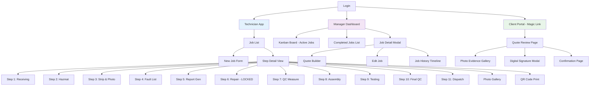
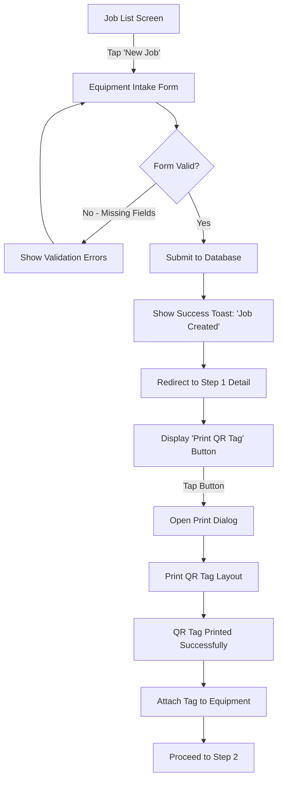
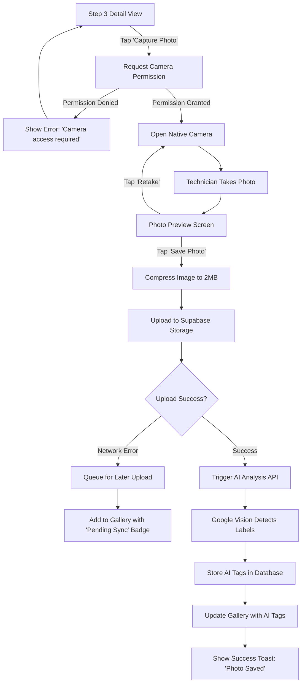
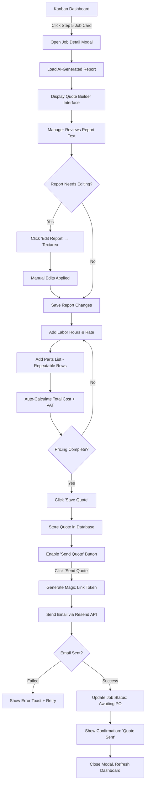
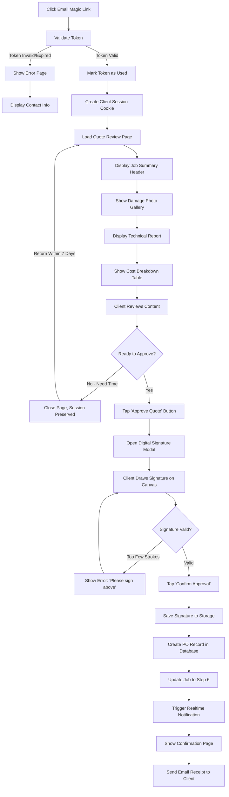
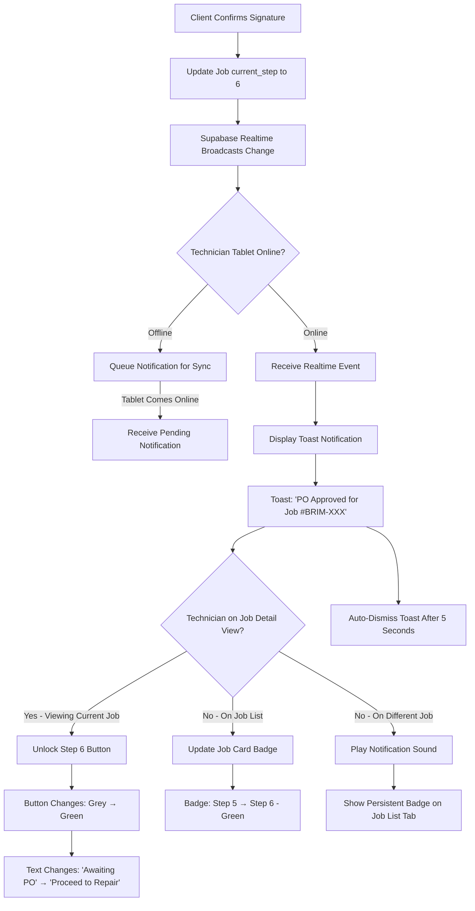

# Workshop Intelligence System (WIS) UI/UX Specification

**Version:** 1.0
**Date:** November 2025
**UX Designer:** Sally | BMad Method
**Status:** Draft for Review

---

## Introduction

This document defines the user experience goals, information architecture, user flows, and visual design specifications for the Workshop Intelligence System's user interface. It serves as the foundation for visual design and frontend development, ensuring a cohesive and user-centered experience across three distinct user types (Technicians, Managers, Clients) with vastly different contexts and needs.

### Overall UX Goals & Principles

#### Target User Personas

**Workshop Technician ("Gloves-On" Power User)**
- **Context:** Industrial workshop floor with grease, noise (80-90 dB), bright overhead lighting creating screen glare
- **Device Usage:** 10-12" tablet in landscape orientation, mounted on rolling cart or handheld
- **Physical Constraints:** Wearing work gloves (leather/nitrile), hands often dirty/wet, standing/walking during use
- **Technical Proficiency:** Moderate digital literacy, comfortable with tablets but not "tech-savvy", prefers simple interfaces
- **Primary Goals:** Complete job steps quickly without administrative burden, capture accurate damage evidence, avoid paperwork
- **Pain Points:** Small touch targets, complex forms, poor readability in bright light, typing with gloves on

**Workshop Manager (Desktop Power User)**
- **Context:** Office environment with desktop computer (1920×1080+ monitor), quiet setting
- **Device Usage:** Desktop/laptop with mouse and keyboard, multi-window workflow
- **Technical Proficiency:** High digital literacy, comfortable with business software, efficiency-focused
- **Primary Goals:** Monitor workshop capacity, accelerate quote generation, ensure compliance, analyze performance
- **Pain Points:** Manual report writing, lack of real-time visibility, fragmented data across systems

**Equipment Owner/Client (Mobile Occasional User)**
- **Context:** On-the-go (smartphone) or office (desktop), reviewing quotes in spare time
- **Device Usage:** Primarily smartphone (375px-428px width), occasionally desktop
- **Technical Proficiency:** Varies widely (assume low-moderate), expects consumer-grade UX
- **Primary Goals:** Quickly review damage evidence, understand repair costs, approve quotes easily
- **Pain Points:** Complex authentication, unclear pricing breakdowns, slow approval processes, lack of transparency

#### Usability Goals

1. **Ease of Learning - Technician:** Technicians can complete their first digital job card (Steps 1-11) in ≤20 minutes with zero training
2. **Efficiency of Use - Manager:** Managers can generate and send quotes 70% faster than manual process (target: <30 minutes vs. 1.5 hours)
3. **Error Prevention - All Users:** Critical actions (PO approval, job completion, dispatch) require explicit confirmation, accidental destructive actions prevented
4. **Gloves-On Operability - Technician:** 100% of technician workflows completable wearing work gloves (minimum 44×44px touch targets, voice input alternative)
5. **Offline Resilience - Technician:** Zero data loss during network interruptions, clear visual feedback on sync status
6. **Accessibility - All Users:** WCAG 2.1 Level AA compliance (4.5:1 contrast, keyboard navigation, screen reader support)
7. **Performance - All Users:** Interactive elements respond <100ms, page transitions <500ms, perceived performance optimized with skeleton screens
8. **Mobile-First - Client:** Quote review and approval fully functional on 375px width smartphones with one-handed operation

#### Design Principles

1. **"Gloves-On" Accessibility First** - Every interactive element must be operable with 5mm-thick work gloves. Large touch targets (60×60px primary actions), generous spacing, avoid tiny icons or multi-touch gestures. Voice input as first-class citizen, not afterthought.

2. **Progressive Disclosure for Cognitive Load** - Show only what's needed for the current step. Technicians see one step at a time with clear "what to do next" guidance. Managers see high-level overview with drill-down for details. Clients see simplified quote summary with expandable sections.

3. **Offline-First Optimistic UI** - All technician actions save immediately with visual confirmation (checkmark animation). Network status always visible but non-intrusive. Sync happens transparently in background. Users never wait for network.

4. **Industrial-Strength Visual Hierarchy** - High contrast (15:1 ratio mode available), large typography (min 16px body, 20px headings), color-coded status (green=complete, yellow=pending, red=blocked), icons always paired with text labels.

5. **Real-Time Awareness Without Interruption** - Live updates appear smoothly without disrupting current workflow. Toast notifications for important events (PO approval) auto-dismiss after 5 seconds. Dashboard refreshes incrementally (no full-page reload).

6. **Context-Aware Input Methods** - Voice-to-text default for long-form notes, numeric keypad for measurements, large dropdown buttons for selections, camera one-tap accessible. Input method matches technician's physical context.

7. **Trust Through Transparency** - Every system action has visible feedback (loading states, success confirmations, error messages). Client portal shows full damage evidence with high-resolution photos. No "black box" AI generation - reports clearly labeled as AI-assisted.

### Change Log

| Date | Version | Description | Author |
|------|---------|-------------|--------|
| November 2025 | 1.0 | Initial UI/UX Specification from PRD | Sally (UX Expert) |

---

## Information Architecture (IA)

### Site Map / Screen Inventory

### Navigation Structure

**Primary Navigation - Technician App (Tablet):**
- **Top App Bar:** Brimis logo (left), Network status indicator (offline/syncing/online), User profile dropdown (right)
- **Bottom Tab Bar (Fixed):**
  - "Active Jobs" icon + label (home)
  - "Scan QR" icon + label (camera trigger for instant job access)
  - "Settings" icon + label (preferences, logout)
- **In-Job Navigation:** Linear wizard with "Back" button (top-left), Step progress indicator (top-center: "Step 3 of 11"), "Complete Step" button (bottom, full-width, fixed position)

**Primary Navigation - Manager Dashboard (Desktop):**
- **Top Navigation Bar:** Brimis logo (left), "Active Jobs" / "Completed Jobs" tabs (center), Search bar, Notifications icon, User profile dropdown (right)
- **Kanban Board:** Horizontal scrollable columns (Steps 1-11), no vertical scroll within columns (fixed height with internal scroll)
- **Job Detail Modal:** Overlays dashboard, "Close" button (top-right X icon), Tabbed sub-navigation (Overview, Photos, History, Edit)

**Primary Navigation - Client Portal (Mobile-First):**
- **Header:** Brimis logo (centered), no navigation menu (single-page experience)
- **Linear Flow:** Quote Summary → Photo Gallery → Digital Signature → Confirmation (automatic progression on approval)
- **Footer:** Brimis contact information, support email link

**Breadcrumb Strategy:**
- **Technician App:** No breadcrumbs (wizard-style linear flow, "Back" button sufficient)
- **Manager Dashboard:** Breadcrumb trail in job detail modal: "Dashboard > Job #BRIM-2025-001 > Edit"
- **Client Portal:** No breadcrumbs (single-page linear flow)

---

## User Flows

### Flow 1: Technician New Job Creation & QR Tag Generation

**User Goal:** Quickly check in new equipment and generate a physical QR tag for tracking

**Entry Points:**
- "New Job" button on technician job list screen (primary CTA, top-right)
- QR scanner screen if technician scans non-existent QR code (prompts to create new job)

**Success Criteria:** Job created in <2 minutes, QR tag printed and ready to attach to equipment

#### Flow Diagram

#### Edge Cases & Error Handling:
- **Offline Mode:** Form saves locally, syncs when online, generates temporary job number (BRIM-OFFLINE-###), prints QR with offline indicator
- **Duplicate Serial Number:** Warning toast "Equipment with serial number [X] already in system (Job #[Y]). Proceed anyway?" with Confirm/Cancel
- **Printer Not Available:** "No printer detected. Save QR code as image and print later?" with Save Image button
- **Form Abandonment:** Auto-save draft to local storage every 10 seconds, prompt on navigation "Save draft job?" if fields filled

**Notes:** QR code must be large enough (50mm × 50mm minimum) to scan reliably with greasy/dirty equipment. Consider laminated tags or industrial label printer for durability.

---

### Flow 2: Technician Photo Capture & AI Defect Tagging

**User Goal:** Document equipment damage with photos and minimal manual tagging effort

**Entry Points:**
- "Capture Photo" button on Step 3 detail view (prominent, camera icon, full-width)

**Success Criteria:** Photo captured, uploaded, AI-tagged, and added to gallery in <30 seconds

#### Flow Diagram

#### Edge Cases & Error Handling:
- **Offline Mode:** Photos stored locally (IndexedDB), queued for upload when online, visible in gallery with "sync pending" indicator
- **Low Storage:** Warning "Device storage low (< 100MB). Delete old photos or free space." with link to device settings
- **AI Analysis Timeout:** After 30 seconds, fallback to "Auto-tagging unavailable - add tags manually" with editable tag input field
- **Poor Image Quality:** If Vision API confidence <50%, suggest "Photo quality low. Retake for better results?" (but allow keeping)
- **Multiple Rapid Photos:** Throttle uploads to 1 per 5 seconds to prevent overwhelming network, queue remaining with progress indicator

**Notes:** Voice-to-text annotation should be available directly from photo preview ("Describe damage" button triggers voice input for photo-specific notes).

---

### Flow 3: Manager Quote Generation & Email Send

**User Goal:** Review AI-generated report, add pricing, and send quote to client

**Entry Points:**
- Clicking job card in "Step 5" column on Kanban dashboard
- "Review Quote" button in job detail modal when current_step = 5

**Success Criteria:** Quote reviewed, priced, and emailed to client in <10 minutes (vs. 1.5 hours manual)

#### Flow Diagram

#### Edge Cases & Error Handling:
- **Missing Client Email:** "Client email not found. Add email address to send quote." with inline email input field
- **AI Report Generation Failed:** Fallback to blank template "Report generation failed. Create manual report." with pre-filled equipment details
- **Email Delivery Failure:** Retry 3 times with exponential backoff, if all fail show "Email service unavailable. Copy magic link to send manually: [URL]"
- **Invalid Pricing:** Validation prevents negative numbers, requires at least 1 labor hour or 1 part, highlights fields with errors in red
- **Large Parts List:** Pagination for >10 parts, "Add Another Part" button always visible at bottom

**Notes:** PDF report preview should be available before sending ("Preview PDF" button opens report in new tab). Consider "Send Test Email" to manager's own email for validation.

---

### Flow 4: Client Quote Approval via Magic Link

**User Goal:** Review equipment damage, understand costs, approve repair quickly from mobile device

**Entry Points:**
- Clicking magic link in email notification
- Direct URL access (if client bookmarked/forwarded link)

**Success Criteria:** Client completes quote review and PO approval in <5 minutes on smartphone

#### Flow Diagram

#### Edge Cases & Error Handling:
- **Link Expired:** "This quote link has expired (72 hours). Please contact Brimis at [email] for a new link."
- **Link Already Used:** "This quote has already been approved. View receipt: [link to confirmation page]"
- **Network Interruption During Signature:** Auto-save signature strokes to local storage, retry upload on reconnect with "Retrying approval..." loading state
- **Large Photo Gallery:** Lazy load images (only first 3 visible initially), infinite scroll for >10 photos, high-res zoom on tap
- **Signature Too Small:** Validation checks signature bounding box minimum 100×50 pixels, prompts "Signature too small - please sign larger"

**Notes:** Consider adding "Questions?" floating action button linking to WhatsApp/email for client support. Signature canvas should support both mouse and touch input for cross-device compatibility.

---

### Flow 5: Real-Time PO Approval Notification to Technician

**User Goal:** Technician receives instant notification when client approves quote, unlocking Step 6 repair work

**Entry Points:**
- Automatic (background Supabase Realtime subscription triggers on database change)

**Success Criteria:** Notification appears on technician tablet <1 second after client signature confirmed (NFR4 requirement)

#### Flow Diagram

#### Edge Cases & Error Handling:
- **Multiple Simultaneous Approvals:** Queue notifications, show one at a time with 3-second intervals to prevent overlap
- **Technician Not Logged In:** Notification missed, but job status reflects approval on next login (no persistent push notification system for MVP)
- **Websocket Connection Lost:** Exponential backoff reconnect (1s, 2s, 4s, 8s intervals), show "Connection lost - retrying..." banner
- **Notification Dismissed Too Quickly:** Permanent green dot badge on job card until technician views the updated job
- **Sound Permission Denied:** Fall back to silent notification with prominent visual indicator (pulsing green animation on tab bar)

**Notes:** Consider haptic feedback (vibration) on tablet for stronger notification awareness in noisy workshop environment. Notification sound should be distinct (positive chime, not alarm).

---

## Wireframes & Mockups

**Primary Design Files:** Figma - Workshop Intelligence System Design Kit
*(Link to Figma file will be added once visual design phase begins)*

### Key Screen Layouts

#### Technician Job List (Tablet - Landscape)

**Purpose:** Primary landing page for technicians showing all active jobs assigned to them

**Key Elements:**
- **Top App Bar (64px height):**
  - Brimis logo (left, 120px width)
  - Network status pill (center-right): Green dot + "Online" | Yellow dot + "Syncing" | Grey dot + "Offline"
  - User avatar + name (right, tap to reveal dropdown: Settings, Help, Logout)
- **Search Bar (56px height, full-width below app bar):**
  - Magnifying glass icon (left)
  - Placeholder: "Search jobs by number, client, or equipment..."
  - Filter icon (right): Opens filter modal (By Step, By Equipment Type, By Date)
- **Job Cards Grid (2-column layout on 10" tablet landscape, 1024px width):**
  - Each card: 480×200px, 16px gap between cards
  - Card content: Job number (24px bold), Client name (18px regular), Equipment type icon + text, Current step badge (colored pill: green=1-2, yellow=3-5, blue=6-10, grey=11-complete), Days in step (small text, bottom-right)
  - Tap card → Navigate to Step Detail View
- **Bottom Tab Bar (72px height, fixed position):**
  - 3 tabs: Active Jobs (list icon) | Scan QR (camera icon) | Settings (gear icon)
  - Active tab highlighted with primary blue, white background
- **Floating Action Button (FAB, 72×72px, bottom-right corner):**
  - "+" icon, primary blue background
  - Label: "New Job" (appears on hover/long-press)
  - Tap → Navigate to Equipment Intake Form

**Interaction Notes:**
- Pull-to-refresh gesture on job list to force sync
- Empty state shows large camera icon + "No active jobs. Scan QR code or tap + to start."
- Skeleton loading state shows 4 grey card outlines while fetching data (perceived performance)

**Design File Reference:** Figma Frame "Tech-JobList-Landscape"

---

#### Step Detail View - Linear Wizard (Tablet - Portrait & Landscape)

**Purpose:** Single-step focused interface for technicians completing workflow stages

**Key Elements:**
- **Progress Header (80px height):**
  - Back button (left, 60×60px touch target, "← Step X" label)
  - Step indicator (center): "Step 3 of 11" + visual progress bar (linear, 11 segments, filled segments green)
  - Help icon (right, 60×60px, ? icon, opens contextual help modal)
- **Step Content Area (scrollable, min-height calculated to keep button visible):**
  - Step title (32px bold): "Step 3: Strip & Assess"
  - Instructions (18px regular, grey): "Capture photos of equipment damage..."
  - Dynamic form fields based on step (textarea, dropdowns, photo gallery, etc.)
  - Voice input button (80×80px, red microphone icon when inactive, animated pulse when recording)
- **Primary Action Button (64px height, full-width, fixed to bottom):**
  - Label: "Complete Step & Continue" (20px bold, white text)
  - Background: Primary blue (enabled), Grey (disabled state)
  - Disabled if form validation fails, shows helper text above button: "Complete all required fields to continue"
- **Secondary Actions (if applicable):**
  - "Save Draft" button (text-only link, top-right of content area)
  - "Print QR Tag" button (Step 1 only, secondary ghost button above primary action)

**Interaction Notes:**
- Swipe right gesture anywhere on screen acts as "Back" (in addition to back button)
- Form fields auto-save to local storage every 10 seconds (prevent data loss)
- Voice input toggles keyboard off, shows live transcription in textarea
- Primary action button is always visible (fixed position, floats above scrollable content)

**Design File Reference:** Figma Frames "Tech-Step-Portrait" and "Tech-Step-Landscape"

---

#### Manager Kanban Dashboard (Desktop - 1920×1080)

**Purpose:** Real-time operational visibility across all jobs organized by workflow step

**Key Elements:**
- **Top Navigation Bar (64px height):**
  - Brimis logo (left, 160px width)
  - Tab navigation (center): "Active Jobs" (bold, underline) | "Completed Jobs" (regular)
  - Global search (right): Icon + input field (300px width), placeholder "Search jobs..."
  - Notification bell icon (right, badge shows count of pending actions)
  - User profile dropdown (right, avatar + name)
- **Kanban Board (fills remaining viewport height, horizontal scroll):**
  - 11 columns (one per step), each 300px width, 16px gap
  - Column header (48px height): "Step X - [Name]" (18px bold) + Job count badge (grey pill, "3 jobs")
  - Column content (scrollable vertically, max-height fills viewport):
    - Job cards: 280×160px, 8px gap, stacked vertically
    - Card content: Job number (18px bold), Client name (14px regular), Equipment icon, Technician avatar (bottom-left), Days in step badge (top-right, color-coded: green <2d, yellow 2-5d, red >5d)
    - Tap card → Open Job Detail Modal
  - Empty column shows "No jobs at this step" (centered, grey text)
- **Real-Time Update Indicator:**
  - Subtle green pulse animation on column header when new job arrives
  - Card slides in from top with fade animation (300ms ease-out)

**Interaction Notes:**
- Horizontal scroll with mouse wheel or trackpad swipe (smooth kinetic scrolling)
- Drag-and-drop NOT implemented for MVP (manual step progression only)
- Column headers sticky (remain visible during vertical scroll within column)
- Kanban board refreshes via Supabase Realtime (no manual refresh needed)

**Design File Reference:** Figma Frame "Manager-Kanban-Desktop"

---

#### Client Quote Review Page (Mobile - 375px Width)

**Purpose:** Mobile-first quote presentation with damage evidence and approval workflow

**Key Elements:**
- **Header (56px height, sticky):**
  - Brimis logo (centered, 100px width)
  - No navigation menu (linear single-page flow)
- **Job Summary Card (white background, 16px padding):**
  - Job number (20px bold, primary blue)
  - Equipment details (16px regular): Type, Serial Number, Date Received
  - Status badge: "Quote Ready for Approval" (green pill)
- **Damage Evidence Section:**
  - Section heading (24px bold): "Damage Evidence"
  - Photo grid (2 columns on mobile, 164px square thumbnails, 8px gap)
  - Tap photo → Opens full-screen lightbox with swipe navigation
  - AI tags displayed below each thumbnail (12px grey chips: "Corrosion • Rust")
- **Technical Report Section (collapsible accordion):**
  - Collapsed state: "Technical Report ▼" (tap to expand)
  - Expanded state: Full report text (16px line-height 1.6 for readability), formatted with headings and bullet points
- **Cost Breakdown Section:**
  - Table layout: Labor (hours × rate), Parts (itemized), Subtotal, VAT (15%), Total (highlighted, 28px bold)
  - Quote validity: "Valid until [date]" (14px grey)
- **Approval Section (sticky footer when scrolled, 80px height):**
  - Large green button (full-width, 56px height): "Approve & Authorize Repair"
  - Tap → Opens Digital Signature Modal (full-screen overlay)

**Interaction Notes:**
- Entire page scrolls vertically (no horizontal scroll)
- Photo lightbox supports pinch-to-zoom and swipe between photos
- Cost breakdown table uses zebra striping for readability (alternating row backgrounds)
- "Questions?" floating action button (bottom-left, 56px circle, WhatsApp icon) links to support contact

**Design File Reference:** Figma Frame "Client-Quote-Mobile-375"

---

## Component Library / Design System

### Design System Approach

**Custom Design System:** "Brimis Workshop UI Kit"
Built on Tailwind CSS utility classes with custom configuration, extending default theme with workshop-specific tokens. No heavy UI framework (Material/Bootstrap) to reduce bundle size and maximize PWA performance. Headless UI library (Radix UI or Headless UI) for accessible unstyled components (modals, dropdowns, tooltips).

### Core Components

#### Button Component

**Purpose:** Primary interaction trigger for all user actions

**Variants:**
- **Primary:** Solid primary blue background, white text, used for main actions ("Complete Step", "Send Quote", "Approve")
- **Secondary:** White background, primary blue border, primary blue text, used for secondary actions ("Save Draft", "Cancel")
- **Ghost:** Transparent background, primary blue text, used for tertiary actions ("Edit", "View Details")
- **Danger:** Solid red background, white text, used for destructive actions ("Delete Job", "Cancel Order")

**States:**
- **Default:** Normal appearance
- **Hover:** Slight darkening (10% opacity overlay), cursor pointer, scale 1.02 on desktop (no scale on mobile to prevent UI shift)
- **Active/Pressed:** Further darkening (20% opacity overlay), scale 0.98 (press feedback)
- **Disabled:** 40% opacity, grey background, cursor not-allowed, no hover effect
- **Loading:** Spinner icon replaces text, button remains interactive appearance but disabled, text fades to "Processing..."

**Usage Guidelines:**
- Minimum touch target: 44×44px (WCAG guideline), 60×60px for primary actions on technician interface
- Icon + text preferred over icon-only (exception: overflow menus where space constrained)
- Primary buttons always full-width on mobile (<768px), auto-width on desktop
- Loading state must prevent double-submission (disable button, show spinner)

---

#### Input Field Component

**Purpose:** Text, number, and selection data entry

**Variants:**
- **Text Input:** Single-line text entry (name, serial number, notes)
- **Textarea:** Multi-line text entry (damage description, repair notes), min-height 120px, auto-expand up to 400px
- **Number Input:** Numeric values with +/- stepper buttons (measurements, hours, quantities), decimal precision configurable
- **Dropdown/Select:** Single-choice selection (equipment type, severity level), large touch-friendly options (min 56px height per option)
- **Voice Input Hybrid:** Text input with integrated microphone button (right side), live transcription replaces typed text

**States:**
- **Default:** Light grey border (1px), white background, placeholder text (grey 60% opacity)
- **Focus:** Primary blue border (2px), blue glow shadow (4px blur), label animates to top (floating label pattern)
- **Filled:** Dark text, label remains at top, clear button (X icon) appears on hover/tap
- **Error:** Red border (2px), red helper text below field, red exclamation icon (right side), shake animation on validation failure
- **Disabled:** Grey background (10% opacity), darker grey text, cursor not-allowed
- **Loading:** Spinner icon (right side), cursor wait, field content greyed out

**Usage Guidelines:**
- Label always visible (no placeholder-only inputs), positioned above field or floating
- Helper text (14px grey) below field for guidance ("Enter in millimeters")
- Error messages specific and actionable ("Serial number must be at least 3 characters")
- Required fields marked with red asterisk (*) in label
- Voice input defaults to continuous mode for long-form fields (auto-punctuation enabled)

---

#### Card Component

**Purpose:** Container for related information (job cards, photo cards, summary cards)

**Variants:**
- **Job Card:** Displays job summary on lists/dashboards (job number, client, status badge)
- **Photo Card:** Image thumbnail with metadata (AI tags, upload date, file size)
- **Summary Card:** Key information highlight (total cost, job count, equipment details)
- **Modal Card:** Full-screen or overlay container for detailed views

**States:**
- **Default:** White background, subtle grey border (1px), 8px border-radius, 4px shadow
- **Hover (Desktop Only):** Slight elevation (8px shadow), border color darkens, cursor pointer
- **Active/Selected:** Primary blue border (2px), white background maintained
- **Disabled:** 40% opacity, no hover effect, cursor not-allowed

**Usage Guidelines:**
- Padding: 16px mobile, 24px desktop
- Tap anywhere on card triggers primary action (navigate to detail view)
- Secondary actions (edit, delete) accessed via overflow menu (3-dot icon, top-right)
- Cards stack vertically on mobile (100% width), grid layout on desktop (2-3 columns)

---

#### Toast Notification Component

**Purpose:** Temporary feedback for user actions and system events

**Variants:**
- **Success:** Green background, white text, checkmark icon (left), "PO Approved for Job #[X]"
- **Error:** Red background, white text, error icon (left), "Email failed to send. Retry?"
- **Warning:** Orange background, white text, alert icon (left), "Device storage low"
- **Info:** Blue background, white text, info icon (left), "Quote sent to client"

**States:**
- **Enter:** Slide in from top with bounce (300ms ease-out), fade in opacity 0 → 1
- **Persist:** Visible for 5 seconds (configurable per notification type)
- **Dismiss:** Fade out opacity 1 → 0 (200ms), slide up (200ms), user can swipe up to dismiss early
- **Action Button:** Optional button (right side): "Retry", "Undo", "View" (keeps toast visible until tapped)

**Usage Guidelines:**
- Max 1 toast visible at a time (queue additional toasts, show sequentially)
- Position: Top-center on desktop (400px width), full-width on mobile (minus 16px margin)
- No toasts for routine confirmations ("Step completed" is redundant with navigation), only for important events
- Critical errors remain visible until user dismisses (no auto-dismiss)

---

#### Photo Gallery Component

**Purpose:** Display and manage damage photo collections

**Variants:**
- **Grid Gallery:** Thumbnail grid view (3 columns desktop, 2 columns mobile)
- **Lightbox:** Full-screen single photo view with zoom and swipe navigation
- **Upload Queue:** Shows pending uploads with progress bars

**States:**
- **Loaded:** Thumbnail displays with AI tag chips below, tap to open lightbox
- **Loading:** Grey skeleton placeholder (shimmer animation), spinner overlay
- **Upload Pending (Offline):** Yellow "sync pending" badge overlay (top-right), upload icon
- **Upload Failed:** Red "upload failed" badge overlay, retry button
- **Zoom (Lightbox):** Pinch-to-zoom 1× to 3× scale, pan when zoomed, double-tap to zoom toggle

**Usage Guidelines:**
- Lazy load images (only first 6 visible, infinite scroll for remainder)
- High-res images loaded on-demand in lightbox (progressive JPEG or WebP)
- Delete action requires confirmation modal: "Delete photo? This cannot be undone."
- Photo metadata (upload date, file size, AI confidence score) visible in lightbox footer

---

## Branding & Style Guide

### Visual Identity

**Brand Guidelines:** Brimis Corporate Identity Manual (internal document)
Logo usage, color palette, and typography defined by existing brand standards. Workshop Intelligence System extends brand for digital application.

### Color Palette

| Color Type | Hex Code | Usage |
|------------|----------|-------|
| **Primary** | #1E3A8A | Primary actions, headers, active states, Brimis brand color |
| **Secondary** | #F97316 | Warning indicators, Hazmat alerts, important notices |
| **Accent** | #06B6D4 | Links, informational highlights, secondary CTAs |
| **Success** | #10B981 | Completed steps, approved status, positive feedback |
| **Warning** | #F59E0B | Pending actions, cautions, moderate alerts |
| **Error** | #EF4444 | Failed states, destructive actions, critical errors |
| **Neutral Grey 900** | #111827 | Primary text, headings (default text color) |
| **Neutral Grey 600** | #4B5563 | Secondary text, helper text, labels |
| **Neutral Grey 400** | #9CA3AF | Disabled text, placeholders, subtle borders |
| **Neutral Grey 200** | #E5E7EB | Dividers, card borders, input borders |
| **Neutral Grey 50** | #F9FAFB | Backgrounds, subtle fills, zebra striping |
| **White** | #FFFFFF | Card backgrounds, input fields, primary canvas |
| **Black** | #000000 | High contrast mode text (15:1 ratio mode) |

**High Contrast Mode Palette (Workshop Lighting):**
- Text: #000000 on #FFFFFF backgrounds (21:1 ratio)
- Primary actions: #0A1F5C (darker blue) on #FFFFFF
- Borders: #000000 (2px width for visibility)

### Typography

#### Font Families

- **Primary:** Inter (sans-serif) - Modern, highly legible at small sizes, excellent on screens
- **Secondary:** System UI fallback (SF Pro on iOS, Roboto on Android) for performance
- **Monospace:** JetBrains Mono (code, serial numbers, job IDs for fixed-width alignment)

#### Type Scale

| Element | Size | Weight | Line Height | Usage |
|---------|------|--------|-------------|-------|
| **H1** | 32px (2rem) | 700 Bold | 1.2 (38px) | Page titles, modal headings |
| **H2** | 24px (1.5rem) | 600 Semibold | 1.3 (31px) | Section headings, card titles |
| **H3** | 20px (1.25rem) | 600 Semibold | 1.4 (28px) | Subsection headings, step titles |
| **Body Large** | 18px (1.125rem) | 400 Regular | 1.6 (29px) | Primary content, technician instructions |
| **Body** | 16px (1rem) | 400 Regular | 1.5 (24px) | Default text, form fields, descriptions |
| **Small** | 14px (0.875rem) | 400 Regular | 1.4 (20px) | Helper text, labels, metadata |
| **XSmall** | 12px (0.75rem) | 500 Medium | 1.3 (16px) | Badges, tags, fine print |
| **Button** | 16px (1rem) | 600 Semibold | 1 (16px) | Button labels, CTAs (all caps) |

**Mobile Adjustments:**
- H1 scales to 28px on <768px screens
- Body scales to 18px on technician tablet interface (larger for glove-friendly reading)

### Iconography

**Icon Library:** Heroicons v2 (Outline style primary, Solid style for active states)

**Usage Guidelines:**
- Icon size: 24×24px default, 32×32px for primary actions on tablet, 20×20px for inline text icons
- Always paired with text labels (except overflow menus where space constrained)
- Color: Inherits text color by default, can be overridden (e.g., green checkmark, red error icon)
- Accessibility: All icons have aria-label or aria-hidden if decorative alongside text

**Custom Icons (Workshop-Specific):**
- Equipment type icons: Pump, Motor, Gearbox, Valve (custom SVG illustrations, 48×48px)
- Step icons: Numbered circles 1-11 for step progress indicators
- QR code icon: Custom design for scan functionality

### Spacing & Layout

**Grid System:** 12-column responsive grid (Tailwind default)
- Mobile (< 768px): Full-width content, 16px horizontal margins
- Tablet (768-1024px): 2-column layouts, 24px horizontal margins
- Desktop (> 1024px): Up to 3-column layouts, 32px horizontal margins, max-width 1440px container

**Spacing Scale (Tailwind rem-based):**
- **XS:** 4px (0.25rem) - Tight spacing, icon gaps
- **SM:** 8px (0.5rem) - Default gap between related elements
- **MD:** 16px (1rem) - Card padding, section spacing
- **LG:** 24px (1.5rem) - Large section spacing, modal padding
- **XL:** 32px (2rem) - Page-level spacing, major sections
- **2XL:** 48px (3rem) - Hero sections, major visual breaks

---

## Accessibility Requirements

### Compliance Target

**Standard:** WCAG 2.1 Level AA (Web Content Accessibility Guidelines)

**Rationale:** Level AA provides strong accessibility baseline suitable for industrial/commercial applications. Level AAA requirements (e.g., 7:1 contrast) would be difficult to meet with existing Brimis brand colors and may compromise visual design cohesion.

### Key Requirements

**Visual:**

- **Color Contrast Ratios:**
  - Normal text (< 18px): Minimum 4.5:1 contrast ratio (e.g., Grey 900 #111827 on White #FFFFFF = 16.8:1 ✓)
  - Large text (≥ 18px or 14px bold): Minimum 3:1 contrast ratio
  - UI components (buttons, borders, icons): Minimum 3:1 contrast against background
  - High contrast mode toggle available (switches to 15:1 minimum ratios for workshop lighting)
- **Focus Indicators:**
  - All focusable elements show 2px solid outline (primary blue #1E3A8A) with 2px offset on keyboard focus
  - Focus outline never removed (no outline: none) unless replaced with equivalent visible indicator
  - Focus order follows logical DOM order (top to bottom, left to right)
- **Text Sizing:**
  - All text resizable up to 200% without loss of functionality or content
  - Minimum 16px base font size (18px for technician interface)
  - No text embedded in images (exception: logos)

**Interaction:**

- **Keyboard Navigation:**
  - All interactive elements reachable via Tab key (tab index order logical)
  - Modal traps focus (Tab cycles within modal, Esc closes modal)
  - Skip to main content link at page top (hidden until focused, allows skipping nav)
  - Dropdown menus navigable with arrow keys, Esc closes, Enter selects
- **Screen Reader Support:**
  - All images have alt text (descriptive for informative images, empty for decorative)
  - Form inputs have associated labels (label element with htmlFor attribute)
  - ARIA labels for icon-only buttons ("aria-label='Close modal'")
  - ARIA live regions for dynamic content (toast notifications, real-time updates)
  - Semantic HTML5 elements (nav, main, article, section) for proper structure
- **Touch Targets:**
  - Minimum 44×44px touch target size (WCAG guideline)
  - Primary actions on technician interface: 60×60px (glove-friendly)
  - Adequate spacing between targets (minimum 8px gap to prevent mis-taps)

**Content:**

- **Alternative Text:**
  - All damage photos include alt text: "Damaged pump impeller showing corrosion and wear" (descriptive, not just "photo")
  - Decorative images (background patterns, dividers) have empty alt="" to hide from screen readers
  - Complex images (diagrams, charts) have long descriptions via aria-describedby
- **Heading Structure:**
  - Proper heading hierarchy (H1 → H2 → H3, no skipping levels)
  - One H1 per page (page title or main heading)
  - Headings describe section content accurately
- **Form Labels:**
  - All form inputs have visible labels (no placeholder-only)
  - Required fields marked with asterisk (*) and aria-required="true"
  - Error messages announced to screen readers via aria-live="assertive"
  - Helper text associated with inputs via aria-describedby

### Testing Strategy

**Automated Testing (CI/CD Pipeline):**
- Axe DevTools integrated into test suite (Jest + React Testing Library)
- Lighthouse CI runs on every build (accessibility score must be ≥ 90)
- Pa11y automated scans for WCAG violations

**Manual Testing (Pre-Launch):**
- Keyboard-only navigation testing (no mouse, all workflows completable via keyboard)
- Screen reader testing: NVDA (Windows), VoiceOver (Mac/iOS), TalkBack (Android)
- Color blindness simulation: Deuteranopia, Protanopia, Tritanopia modes (browser DevTools)
- High contrast mode validation (Windows high contrast settings)
- Zoom testing: 200% browser zoom, ensure no content loss or horizontal scroll

**User Testing (Post-Launch):**
- Accessibility feedback collection via in-app survey (optional)
- Priority issues logged and addressed in maintenance sprints

---

## Responsiveness Strategy

### Breakpoints

| Breakpoint | Min Width | Max Width | Target Devices | Layout Changes |
|------------|-----------|-----------|----------------|----------------|
| **Mobile** | 320px | 767px | iPhone SE, iPhone 12/13 Pro, Android phones | Single column, stacked navigation, full-width cards |
| **Tablet** | 768px | 1023px | iPad 10.2", Samsung Galaxy Tab, iPad Pro 11" | 2-column grid, persistent bottom tab bar, larger touch targets |
| **Desktop** | 1024px | 1919px | MacBook Air, standard monitors, laptops | 3-column grid, top navigation bar, mouse-optimized interactions |
| **Wide** | 1920px | - | 4K displays, ultra-wide monitors | Max-width 1440px container (centered), increased padding |

### Adaptation Patterns

**Layout Changes:**

- **Mobile (< 768px):**
  - Hamburger menu for navigation (if secondary nav needed)
  - Cards stack vertically (100% width)
  - Forms single column, full-width inputs
  - Modals full-screen takeover (not centered overlay)
- **Tablet (768-1023px):**
  - Bottom tab bar for primary navigation (thumb-friendly)
  - 2-column card grid (480px per column)
  - Forms 2-column where logical (e.g., First Name | Last Name side-by-side)
  - Modals centered overlay (80% screen width)
- **Desktop (≥ 1024px):**
  - Top navigation bar (persistent)
  - 3-column card grid or Kanban columns
  - Forms multi-column (logical grouping)
  - Modals centered overlay (max 800px width)

**Navigation Changes:**

- **Mobile:** Bottom tab bar OR hamburger menu (primary nav collapses)
- **Tablet:** Bottom tab bar persistent (landscape mode: 4 tabs fit comfortably)
- **Desktop:** Top navigation bar with dropdowns (hover-triggered mega menus if needed)

**Content Priority:**

- **Mobile:** Critical information above fold (job number, status, primary action)
- **Tablet:** More metadata visible (technician name, equipment type, days in step)
- **Desktop:** Full metadata, additional context, preview panels

**Interaction Changes:**

- **Mobile:** Touch-only (swipe gestures, tap to select, pull-to-refresh)
- **Tablet:** Touch-primary (larger targets, voice input prominent)
- **Desktop:** Mouse-primary (hover states, keyboard shortcuts, right-click context menus)

---

## Animation & Micro-interactions

### Motion Design Principles

1. **Purposeful Motion:** Animations serve functional purpose (provide feedback, guide attention, communicate state change), never decorative
2. **Performance First:** All animations GPU-accelerated (transform, opacity only), avoid layout thrashing (no animating width/height)
3. **Reduced Motion Support:** Respect prefers-reduced-motion media query (disable non-essential animations for users with motion sensitivity)
4. **Consistent Timing:** Use standard easing curves (ease-out for enter, ease-in for exit, ease-in-out for position changes)

### Key Micro-interactions

**Button Press Feedback:**
- **Trigger:** User taps button
- **Animation:** Scale down to 0.96 (40ms ease-out), haptic feedback on mobile (if supported)
- **Purpose:** Confirm touch registration, provide tactile feedback

**Step Completion Confirmation:**
- **Trigger:** User completes step, taps "Complete Step & Continue"
- **Animation:** Green checkmark icon fades in (300ms ease-out), grows from 0.8× to 1× scale, confetti burst (optional, can be disabled in settings)
- **Purpose:** Celebrate progress, provide positive reinforcement

**Photo Upload Success:**
- **Trigger:** Photo successfully uploaded to storage
- **Animation:** Thumbnail fades in (200ms), slide up from bottom (300ms ease-out), green checkmark badge appears top-right (100ms delay)
- **Purpose:** Confirm successful upload, show progress

**Real-Time Notification Arrival:**
- **Trigger:** PO approval notification received
- **Animation:** Toast slides down from top (300ms ease-out with bounce), notification icon badge pulses (scale 1 → 1.2 → 1, 600ms loop 3 times)
- **Purpose:** Draw attention to important event without blocking workflow

**Skeleton Loading:**
- **Trigger:** Page loading, data fetching
- **Animation:** Grey placeholder blocks with shimmer effect (linear gradient moving left-to-right, 1.5s infinite loop)
- **Purpose:** Indicate loading state, improve perceived performance

**Swipe to Delete (Job Cards):**
- **Trigger:** User swipes left on job card (mobile/tablet only)
- **Animation:** Card slides left revealing red "Delete" button background (200ms ease-out), haptic feedback on swipe threshold
- **Purpose:** Enable quick delete action, provide undo before permanent deletion

### Performance Considerations

**Animation Budget:**
- Target: 60fps (16.67ms per frame budget)
- Monitor with browser DevTools Performance tab
- Avoid animating during critical user input (e.g., typing in form)

**Reduced Motion Mode:**
- When prefers-reduced-motion: reduce media query active:
  - Disable all non-essential animations (confetti, shimmer, bounces)
  - Maintain functional animations (loading spinners, focus indicators) with instant transitions (0ms duration)
  - Replace slide/fade transitions with instant visibility changes

---

## Performance Considerations (Frontend-Specific)

### Load Time Optimization

- **Code Splitting:** Route-based code splitting (Next.js dynamic imports), load only required JavaScript for current page
- **Image Optimization:** Next.js Image component with automatic WebP conversion, responsive srcset, lazy loading below fold
- **Font Loading:** Self-host Inter font (avoid Google Fonts latency), use font-display: swap to prevent invisible text
- **Critical CSS:** Inline critical above-fold CSS, defer non-critical stylesheets
- **Bundle Size:** Target <500KB initial JavaScript bundle (before code splitting)

### Runtime Performance

- **Virtualization:** For long lists (>100 items), use react-window or react-virtualized to render only visible items
- **Debouncing/Throttling:** Debounce search input (300ms delay), throttle scroll events (16ms for 60fps)
- **Memoization:** React.memo for expensive components, useMemo for heavy computations, useCallback for event handlers
- **Avoid Layout Thrashing:** Batch DOM reads and writes, use requestAnimationFrame for scroll-driven updates

### Offline Performance

- **Service Worker Caching:** App shell cached (HTML, CSS, JS), API responses cached with network-first strategy
- **IndexedDB Storage:** Photos and form data stored locally, automatic sync when online
- **Optimistic UI:** Actions appear successful immediately (before server confirmation), revert if sync fails

### Perceived Performance

- **Skeleton Screens:** Show content structure immediately, replace with real data as it loads
- **Progressive Image Loading:** Blur-up technique (load low-res placeholder, fade in high-res)
- **Instant Feedback:** UI responds to input <100ms (buttons change state, form validates, etc.)

---

## Next Steps & Design Handoff

### For Visual Design Phase (Not in MVP Scope)

- Create high-fidelity mockups in Figma for all key screens (Technician, Manager, Client)
- Design component library with all variants and states documented
- Conduct usability testing with workshop technicians (5 participants minimum)
- Iterate on tablet interface based on glove-wearing testing feedback

### For Frontend Development (Current Phase)

**Priority 1 - Technician Interface (Week 2-3):**
- Implement linear wizard step navigation with progress indicator
- Build voice-to-text input component with Web Speech API
- Create photo capture and gallery components with offline queue
- Implement QR code scanner and generator

**Priority 2 - Manager Dashboard (Week 3-4):**
- Build Kanban board with Supabase Realtime integration
- Create job detail modal with tabbed navigation
- Implement quote builder form with auto-calculation
- Build search and filter functionality

**Priority 3 - Client Portal (Week 4):**
- Create magic link authentication flow
- Build responsive quote review page (mobile-first)
- Implement digital signature canvas component
- Design confirmation page

**Priority 4 - PWA & Offline (Week 4-5):**
- Configure service worker with Workbox
- Implement offline queue and background sync
- Add install prompt for home screen
- Test offline functionality across all workflows

### Design QA Checklist (Pre-Launch)

- [ ] All touch targets ≥ 44×44px (≥ 60×60px for technician interface)
- [ ] Color contrast ratios meet WCAG 2.1 AA (4.5:1 for text, 3:1 for UI components)
- [ ] Keyboard navigation works for all interactive elements
- [ ] Screen reader announces all dynamic content changes
- [ ] High contrast mode toggle functional (15:1 ratio)
- [ ] Voice input works reliably in noisy environment (tested at 80+ dB)
- [ ] Offline mode saves all data locally and syncs when online
- [ ] Real-time notifications appear <1 second after database update
- [ ] Photo gallery supports zoom and swipe on mobile
- [ ] Form validation provides specific, actionable error messages

---

**End of Front-End Specification**

*This document will be refined iteratively based on user testing feedback and technical feasibility during development.*
