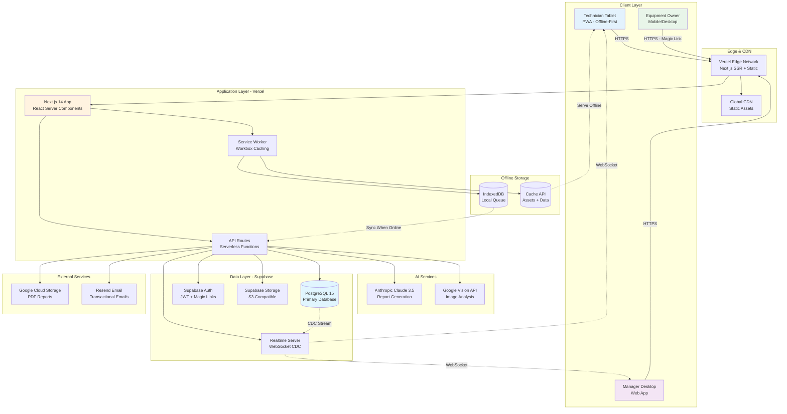
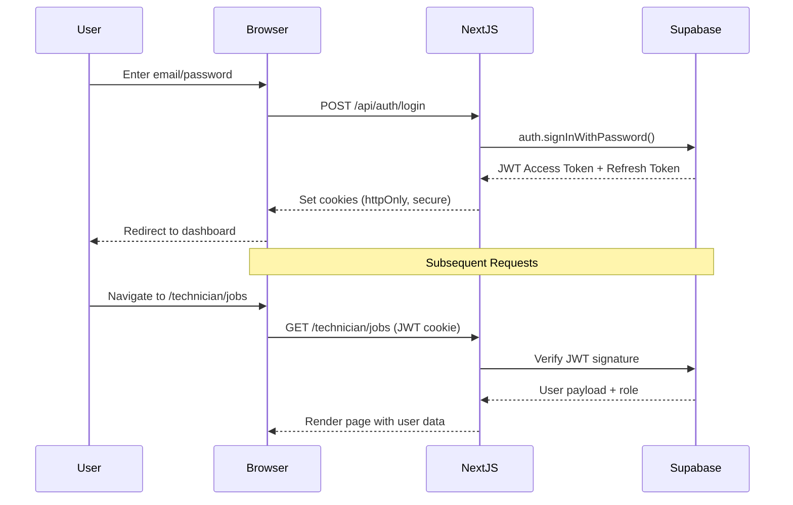
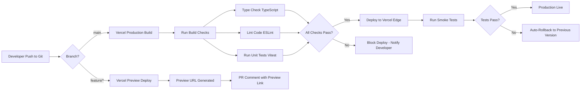

# Workshop Intelligence System (WIS) Fullstack Architecture Document

**Version:** 1.0
**Date:** November 2025
**Architect:** Winston | BMad Method
**Status:** Draft for Review

---

## Introduction

This document outlines the complete fullstack architecture for the Workshop Intelligence System (WIS), including backend systems, frontend implementation, offline-first PWA capabilities, AI service integration, and real-time synchronization mechanisms. It serves as the single source of truth for development, ensuring consistency across the entire technology stack during the aggressive 5-week development timeline.

This unified approach combines frontend, backend, data, infrastructure, and security architecture into a cohesive design optimized for rapid AI-driven development while maintaining production-grade quality standards.

### Starter Template or Existing Project

**Status:** Greenfield Project (No Existing Codebase)

**Recommended Starter:** Next.js 14 Vercel Template with Supabase Integration

While we could bootstrap from scratch, I recommend using the official Next.js 14 App Router template with TypeScript and Tailwind CSS, then integrating Supabase via their Next.js quickstart. This provides:
- Pre-configured TypeScript + ESLint + Prettier setup
- Optimized build configuration for Vercel deployment
- Example API route structure
- Tailwind CSS with sensible defaults

**Customizations Required:**
- Add PWA configuration (next-pwa plugin)
- Configure Supabase client with environment variables
- Set up Workbox for offline caching strategy
- Add Anthropic and Google Cloud SDK dependencies

**Decision:** Use official `create-next-app` template, customize for WIS requirements

### Change Log

| Date | Version | Description | Author |
|------|---------|-------------|--------|
| November 2025 | 1.0 | Initial fullstack architecture from PRD and UX Spec | Winston (Architect) |

---

## High Level Architecture

### Technical Summary

The Workshop Intelligence System is built as a **monolithic Next.js 14 application** deployed on Vercel's Edge Network, leveraging React Server Components for performance and Supabase (PostgreSQL + Realtime + Auth + Storage) for the data layer. The frontend is a **Progressive Web App (PWA)** with offline-first capabilities, using service workers for caching and IndexedDB for local data persistence, enabling technicians to work in workshops with unreliable connectivity.

The system integrates **two AI services**: Anthropic Claude 3.5 Sonnet for technical report generation and Google Cloud Vision API for automated defect detection from repair photos. These services are orchestrated through Next.js API routes with intelligent retry logic and fallback mechanisms. A custom-built **11-Step Workflow State Machine** enforces the Brimis service process with PostgreSQL-backed validation gates and Row-Level Security (RLS) policies ensuring data isolation between users.

**Real-time synchronization** is achieved via Supabase Realtime (PostgreSQL Change Data Capture), pushing PO approval notifications to technician tablets with <1-second latency. The architecture prioritizes **developer experience** with TypeScript strict mode, comprehensive type generation from Supabase schemas, and a clear separation of concerns (UI components, business logic services, data access repositories).

This design achieves the PRD's aggressive performance targets (<2s page loads, <60s AI generation, 99.9% uptime) through strategic code splitting, aggressive caching (Vercel Edge, CDN, Service Worker), and optimistic UI patterns that make the interface feel instant even with network delays.

### Platform and Infrastructure Choice

**Platform:** Vercel + Supabase + Google Cloud (Hybrid Multi-Cloud)

**Rationale:**
- **Vercel:** Best-in-class Next.js hosting with automatic Edge deployment, zero-config CI/CD (git push to deploy), built-in analytics, and serverless function optimization. Provides 99.99% uptime SLA and global CDN.
- **Supabase:** Managed PostgreSQL with built-in Auth, Realtime subscriptions, Row-Level Security, and S3-compatible storage. Reduces operational overhead vs. self-managed Postgres + custom WebSocket server. Open-source (avoids vendor lock-in if migration needed).
- **Google Cloud:** Required for Vision API (no Supabase equivalent), stores large PDF reports in Cloud Storage with signed URLs for secure client access.

**Key Services:**
- **Vercel Edge Network:** Frontend hosting, serverless functions (Next.js API routes), CDN for static assets
- **Supabase Cloud (US East):** PostgreSQL 15 database, Realtime server, Auth service, Storage (repair photos)
- **Google Cloud Storage (Multi-region):** PDF report archival, delivery note storage
- **Google Cloud Vision API:** Image analysis for defect tagging
- **Anthropic Claude API:** Natural language report generation
- **Resend (Email Service):** Transactional emails (quote notifications, receipts)

**Deployment Regions:**
- **Primary:** US East (Vercel: iad1, Supabase: us-east-1) - Co-located for latency optimization
- **CDN:** Global edge caching (Vercel's 300+ edge locations)

**Alternative Considered:** AWS Full Stack (Lambda + API Gateway + RDS + Cognito)
- **Rejected:** Higher operational complexity, slower development velocity, more expensive at <10K MAU scale

### Repository Structure

**Structure:** Monorepo (Single Repository)

**Rationale:** For a cohesive Next.js application where frontend and backend are tightly coupled (shared types, unified deployment), a monorepo provides the best developer experience. Avoids complexity of managing multiple repos, simplifies type sharing, and enables atomic commits across frontend/backend changes.

**Monorepo Tool:** Native Next.js (No external monorepo tool)

**Justification:** Next.js 14 App Router with `/app` directory provides sufficient organization for our scope. Adding Turborepo/Nx would be premature optimization for a single-application project.

**Package Organization:**

```
/workshop-app
├── /app                    # Next.js 14 App Router (pages, layouts, API routes)
│   ├── /(auth)             # Auth routes (login, logout)
│   ├── /technician         # Technician interface routes
│   ├── /manager            # Manager dashboard routes
│   ├── /client             # Client portal routes (magic link)
│   └── /api                # API routes (serverless functions)
│       ├── /ai             # AI service integrations
│       ├── /jobs           # Job CRUD operations
│       ├── /qr             # QR code generation
│       └── /webhooks       # External service webhooks
├── /components             # React components (UI, business logic)
│   ├── /ui                 # Generic UI components (buttons, inputs, cards)
│   ├── /features           # Feature-specific components (JobCard, StepWizard)
│   └── /layouts            # Layout components (AppShell, TechnicianLayout)
├── /lib                    # Shared utilities and business logic
│   ├── /ai                 # AI service clients (Claude, Vision)
│   ├── /db                 # Database utilities (Supabase client, queries)
│   │   ├── /repositories   # Data access layer (JobRepository, UserRepository)
│   │   └── /migrations     # Database migration tracking
│   ├── /workflow           # 11-Step state machine logic
│   ├── /auth               # Authentication helpers
│   ├── /storage            # File upload/download utilities
│   └── /utils              # Generic utilities (date, validation, etc.)
├── /public                 # Static assets (images, fonts, icons)
│   ├── /icons              # App icons (PWA manifest)
│   └── /fonts              # Self-hosted Inter font files
├── /styles                 # Global styles (Tailwind config, CSS)
├── /types                  # TypeScript type definitions
│   ├── /database.ts        # Supabase generated types
│   └── /api.ts             # API route types
├── /tests                  # Test files (unit, integration)
│   ├── /unit               # Component and function tests
│   ├── /integration        # API route tests
│   └── /fixtures           # Test data
├── /docs                   # Project documentation
│   ├── /project-brief.md
│   ├── /prd.md
│   ├── /front-end-spec.md
│   └── /fullstack-architecture.md (this file)
├── /supabase               # Supabase configuration
│   ├── /migrations         # SQL migration files
│   └── config.toml         # Supabase project config
├── .env.local              # Environment variables (git-ignored)
├── .env.example            # Example environment variables (committed)
├── next.config.js          # Next.js configuration (PWA, image domains)
├── tailwind.config.js      # Tailwind CSS configuration
├── tsconfig.json           # TypeScript configuration
├── package.json            # Dependencies and scripts
└── README.md               # Project setup instructions
```

**Shared Code Strategy:**
- **Types:** Supabase CLI generates TypeScript types from database schema (`types/database.ts`), shared across frontend and API routes
- **Validation:** Zod schemas in `/lib/validation` used for both client-side and server-side validation
- **Constants:** Shared enums (JobStatus, UserRole, StepNumber) in `/lib/constants`

### High Level Architecture Diagram



### Architectural Patterns

- **Jamstack Architecture:** Static-first rendering with dynamic API calls for data mutations - _Rationale:_ Optimal performance via CDN edge caching, reduces server load, enables offline-first PWA capabilities

- **Progressive Web App (PWA):** Service worker caching, offline queue, installable app experience - _Rationale:_ Technicians work in workshops with unreliable connectivity; offline-first design is critical to prevent data loss and workflow interruption

- **Server Components + Client Components Hybrid:** React Server Components for data fetching, Client Components for interactivity - _Rationale:_ Reduces JavaScript bundle size (technician tablets benefit from smaller downloads), improves initial page load performance

- **Repository Pattern:** Data access abstraction layer (`JobRepository`, `UserRepository`) - _Rationale:_ Decouples business logic from Supabase implementation details, enables easier testing with mock repositories, future database migration flexibility

- **State Machine Pattern:** Finite state machine for 11-step workflow with validation guards - _Rationale:_ Enforces business rules (step sequencing, mandatory gates) at code level, prevents invalid state transitions, provides clear audit trail

- **Optimistic UI Pattern:** Immediate UI updates with background sync and rollback on failure - _Rationale:_ Makes interface feel instant even with network delays, critical for offline-first UX, improves perceived performance

- **Backend for Frontend (BFF) via API Routes:** Next.js API routes orchestrate multiple services (Supabase, Claude, Vision) - _Rationale:_ Keeps API keys secure (never exposed to client), enables request aggregation (single client request = multiple backend calls), simplifies client logic

- **Event-Driven Real-Time Updates:** Supabase Realtime subscriptions trigger UI updates - _Rationale:_ Provides instant PO approval notifications (<1s latency requirement), eliminates polling overhead, enables collaborative features (manager sees technician progress)

- **Layered Security (Defense in Depth):** Row-Level Security (DB) + Middleware (API) + Client Validation (UI) - _Rationale:_ Multiple security layers ensure data isolation even if one layer fails, follows zero-trust principles

- **API Gateway Pattern (Implicit via Vercel):** Vercel Edge handles rate limiting, DDoS protection, SSL termination - _Rationale:_ Reduces custom infrastructure code, leverages platform capabilities, automatic global distribution

---

## Tech Stack

### Technology Stack Table

| Category | Technology | Version | Purpose | Rationale |
|----------|------------|---------|---------|-----------|
| **Frontend Language** | TypeScript | 5.3+ | Type-safe JavaScript superset for all frontend code | Catches errors at compile-time, enables better IDE support, self-documenting code via types, required for Supabase type generation |
| **Frontend Framework** | Next.js (App Router) | 14.0+ | React meta-framework with SSR, static generation, API routes | Best-in-class developer experience, automatic code splitting, built-in image optimization, Vercel-optimized, React Server Components support |
| **UI Component Library** | Headless UI + Custom | 1.7+ | Unstyled accessible components (modals, dropdowns, etc.) | WCAG-compliant out of the box, no heavy CSS framework bloat, full control over styling with Tailwind, lightweight bundle size |
| **State Management** | React Context + Zustand | Context: Built-in<br/>Zustand: 4.4+ | Global state (user session, offline queue) | Context sufficient for auth state, Zustand for complex client state (offline queue), avoids Redux complexity/boilerplate |
| **Backend Language** | TypeScript (Node.js) | 5.3+ (Node 18 LTS) | Serverless function runtime for Next.js API routes | Type safety across frontend/backend, code reuse (validation schemas), single language reduces context switching |
| **Backend Framework** | Next.js API Routes | 14.0+ | Serverless HTTP endpoints for business logic | Zero configuration, automatic deployment with frontend, co-located with UI code, Vercel-optimized cold start <50ms |
| **API Style** | REST (JSON) | HTTP/1.1 + HTTP/2 | Synchronous request/response for CRUD operations | Simpler than GraphQL for this use case, widely understood, excellent browser/tool support, no code generation needed |
| **Database** | PostgreSQL (Supabase) | 15.x | Primary relational database for all application data | ACID compliance for workflow integrity, Row-Level Security built-in, JSON support for flexible fields, mature ecosystem |
| **Cache** | Vercel Edge Cache | Built-in | CDN caching for static assets and API responses | Zero configuration, global distribution, automatic invalidation, reduces database load, improves latency |
| **File Storage** | Supabase Storage + Google Cloud Storage | Supabase: Latest<br/>GCS: Latest | Photos (Supabase), PDFs (GCS) with signed URLs | Supabase for app-generated photos (integrated with RLS), GCS for large PDF archival (cheaper long-term storage) |
| **Authentication** | Supabase Auth | Latest | JWT-based auth with email/password and magic links | Built-in user management, automatic JWT refresh, magic link support for clients, RLS integration, session management |
| **Frontend Testing** | Vitest + Testing Library | Vitest: 1.0+<br/>Testing Library: 14+ | Unit tests for components and utility functions | Faster than Jest (Vite-powered), React Testing Library best practices, excellent TypeScript support |
| **Backend Testing** | Vitest + Supertest | Vitest: 1.0+<br/>Supertest: 6.3+ | Integration tests for API routes | Same test runner as frontend (consistent DX), Supertest for HTTP assertions, can mock Supabase client |
| **E2E Testing** | Playwright (Phase 2) | 1.40+ | End-to-end user flow testing across browsers | Deferred to Phase 2 per PRD, but Playwright chosen for multi-browser support, auto-wait, network mocking |
| **Build Tool** | Next.js (Webpack + Turbopack) | 14.0+ | Compile TypeScript, bundle JavaScript, optimize assets | Built into Next.js, zero config, Turbopack for faster builds (7x faster than Webpack), tree shaking |
| **Bundler** | Turbopack (Next.js 14) | 14.0+ | JavaScript/CSS bundling and code splitting | Next.js default, faster than Webpack, intelligent code splitting, optimized for Vercel deployment |
| **CSS Framework** | Tailwind CSS | 3.4+ | Utility-first CSS framework for rapid styling | Minimal bundle size (purged unused CSS), mobile-first responsive, excellent DX with IntelliSense, matches UX spec |
| **PWA** | next-pwa (Workbox) | 5.6+ | Service worker generation, offline caching, install prompt | Zero-config PWA setup for Next.js, Workbox caching strategies, precaching, background sync |
| **IaC Tool** | Vercel CLI + Supabase CLI | Vercel: Latest<br/>Supabase: Latest | Infrastructure provisioning and configuration | Declarative config files (vercel.json, supabase/config.toml), git-based deployments, no Terraform needed |
| **CI/CD** | Vercel Git Integration | Built-in | Automatic build/deploy on git push, preview deploys | Zero configuration, PR previews, automatic production deploys, rollback support, build caching |
| **Monitoring** | Vercel Analytics + Sentry | Vercel: Built-in<br/>Sentry: 7.x+ | Performance monitoring, error tracking, user analytics | Vercel for Web Vitals and performance, Sentry for error aggregation and stack traces, alerting |
| **Logging** | Axiom + Vercel Logs | Axiom: Latest<br/>Vercel: Built-in | Structured log aggregation for production debugging | Axiom for queryable structured logs, Vercel for build logs, searchable, retention policies |

**Additional Dependencies:**

| Library | Version | Purpose |
|---------|---------|---------|
| `@anthropic-ai/sdk` | 0.9+ | Anthropic Claude API client |
| `@google-cloud/vision` | 4.0+ | Google Cloud Vision API client |
| `@supabase/supabase-js` | 2.38+ | Supabase JavaScript client (auth, database, storage, realtime) |
| `react-hook-form` | 7.48+ | Performant form library with validation |
| `zod` | 3.22+ | TypeScript-first schema validation (forms, API input) |
| `qrcode` | 1.5+ | QR code generation (job tags) |
| `html5-qrcode` | 2.3+ | QR code scanning (camera access) |
| `puppeteer` | 21.+ | Headless Chrome for PDF generation |
| `date-fns` | 2.30+ | Date manipulation and formatting |
| `clsx` | 2.0+ | Conditional CSS class names utility |
| `sharp` | 0.33+ | Image optimization (automatic via Next.js Image component) |

---

## Data Models

### Database Schema Overview

The database is designed with **normalization** for data integrity and **denormalization** where necessary for performance. All tables use UUID primary keys for security (prevents enumeration attacks). **Row-Level Security (RLS)** policies enforce data isolation: technicians can only access jobs assigned to them, managers can access all jobs, clients can only access their own quotes via magic link tokens.

**Schema Relationships:**
- `users` ← (many-to-one) → `jobs` (via `assigned_technician_id`)
- `jobs` ← (one-to-many) → `job_steps` (audit trail of step completions)
- `jobs` ← (one-to-many) → `job_photos` (damage evidence photos)
- `jobs` ← (one-to-one) → `quotes` (pricing and client approval)
- `jobs` ← (one-to-one) → `purchase_orders` (digital PO approval record)
- `jobs` ← (one-to-one) → `client_tokens` (magic link authentication)

### Entity Relationship Diagram

```mermaid
erDiagram
    USERS ||--o{ JOBS : "assigned_to"
    JOBS ||--|{ JOB_STEPS : "has_history"
    JOBS ||--o{ JOB_PHOTOS : "has_photos"
    JOBS ||--o| QUOTES : "has_quote"
    JOBS ||--o| PURCHASE_ORDERS : "has_po"
    JOBS ||--o| CLIENT_TOKENS : "has_token"

    USERS {
        uuid id PK
        text email UK
        text full_name
        enum role "technician|manager"
        timestamp created_at
        timestamp updated_at
    }

    JOBS {
        uuid id PK
        text job_number UK "BRIM-YYYY-###"
        text client_name
        text client_email
        text equipment_type
        text serial_number
        int current_step "1-11"
        enum status "active|awaiting_po|completed|cancelled"
        uuid assigned_technician_id FK
        text qr_code
        timestamp created_at
        timestamp updated_at
        timestamp completed_at
    }

    JOB_STEPS {
        uuid id PK
        uuid job_id FK
        int step_number "1-11"
        uuid completed_by_user_id FK
        jsonb data "step-specific fields"
        timestamp completed_at
    }

    JOB_PHOTOS {
        uuid id PK
        uuid job_id FK
        int step_number "3|8|9"
        text photo_url
        jsonb ai_tags "array of detected labels"
        text caption
        boolean deleted
        timestamp uploaded_at
    }

    QUOTES {
        uuid id PK
        uuid job_id FK UK
        decimal labor_hours
        decimal hourly_rate
        jsonb parts "array of parts with prices"
        decimal total_cost
        timestamp created_at
        timestamp updated_at
    }

    PURCHASE_ORDERS {
        uuid id PK
        uuid job_id FK UK
        text signature_url
        text client_ip
        text client_user_agent
        timestamp approved_at
    }

    CLIENT_TOKENS {
        uuid id PK
        uuid job_id FK UK
        text token UK
        boolean used
        timestamp expires_at
        timestamp created_at
    }
```

### Detailed Table Schemas

#### `users` Table

```sql
CREATE TABLE users (
  id UUID PRIMARY KEY DEFAULT uuid_generate_v4(),
  email TEXT NOT NULL UNIQUE,
  full_name TEXT NOT NULL,
  role TEXT NOT NULL CHECK (role IN ('technician', 'manager')),
  created_at TIMESTAMP WITH TIME ZONE DEFAULT NOW(),
  updated_at TIMESTAMP WITH TIME ZONE DEFAULT NOW()
);

-- Index for faster lookups by email
CREATE INDEX idx_users_email ON users(email);

-- Row-Level Security
ALTER TABLE users ENABLE ROW LEVEL SECURITY;

-- Policy: Users can read their own record
CREATE POLICY users_select_own ON users FOR SELECT USING (auth.uid() = id);

-- Policy: Managers can read all users
CREATE POLICY users_select_managers ON users FOR SELECT USING (
  EXISTS (
    SELECT 1 FROM users WHERE id = auth.uid() AND role = 'manager'
  )
);
```

#### `jobs` Table

```sql
CREATE TABLE jobs (
  id UUID PRIMARY KEY DEFAULT uuid_generate_v4(),
  job_number TEXT NOT NULL UNIQUE,
  client_name TEXT NOT NULL,
  client_email TEXT NOT NULL,
  equipment_type TEXT NOT NULL,
  serial_number TEXT NOT NULL,
  current_step INTEGER NOT NULL DEFAULT 1 CHECK (current_step >= 1 AND current_step <= 11),
  status TEXT NOT NULL DEFAULT 'active' CHECK (status IN ('active', 'awaiting_po', 'completed', 'cancelled')),
  assigned_technician_id UUID REFERENCES users(id),
  qr_code TEXT,
  created_at TIMESTAMP WITH TIME ZONE DEFAULT NOW(),
  updated_at TIMESTAMP WITH TIME ZONE DEFAULT NOW(),
  completed_at TIMESTAMP WITH TIME ZONE
);

-- Indexes for common queries
CREATE INDEX idx_jobs_assigned_technician ON jobs(assigned_technician_id);
CREATE INDEX idx_jobs_status ON jobs(status);
CREATE INDEX idx_jobs_current_step ON jobs(current_step);
CREATE INDEX idx_jobs_created_at ON jobs(created_at DESC);

-- Row-Level Security
ALTER TABLE jobs ENABLE ROW LEVEL SECURITY;

-- Policy: Technicians can read/update only their assigned jobs
CREATE POLICY jobs_technician_select ON jobs FOR SELECT USING (
  assigned_technician_id = auth.uid()
);

CREATE POLICY jobs_technician_update ON jobs FOR UPDATE USING (
  assigned_technician_id = auth.uid()
);

-- Policy: Managers can read/update all jobs
CREATE POLICY jobs_manager_all ON jobs FOR ALL USING (
  EXISTS (
    SELECT 1 FROM users WHERE id = auth.uid() AND role = 'manager'
  )
);

-- Trigger: Update updated_at timestamp on every change
CREATE TRIGGER update_jobs_updated_at BEFORE UPDATE ON jobs
  FOR EACH ROW EXECUTE FUNCTION update_updated_at_column();
```

#### `job_steps` Table (Audit Trail)

```sql
CREATE TABLE job_steps (
  id UUID PRIMARY KEY DEFAULT uuid_generate_v4(),
  job_id UUID NOT NULL REFERENCES jobs(id) ON DELETE CASCADE,
  step_number INTEGER NOT NULL CHECK (step_number >= 1 AND step_number <= 11),
  completed_by_user_id UUID NOT NULL REFERENCES users(id),
  data JSONB DEFAULT '{}',
  completed_at TIMESTAMP WITH TIME ZONE DEFAULT NOW()
);

-- Index for querying steps by job
CREATE INDEX idx_job_steps_job_id ON job_steps(job_id);
CREATE INDEX idx_job_steps_step_number ON job_steps(step_number);

-- Row-Level Security (inherits from jobs table)
ALTER TABLE job_steps ENABLE ROW LEVEL SECURITY;

CREATE POLICY job_steps_select ON job_steps FOR SELECT USING (
  EXISTS (
    SELECT 1 FROM jobs WHERE id = job_id AND (
      assigned_technician_id = auth.uid() OR
      EXISTS (SELECT 1 FROM users WHERE id = auth.uid() AND role = 'manager')
    )
  )
);

CREATE POLICY job_steps_insert ON job_steps FOR INSERT WITH CHECK (
  EXISTS (
    SELECT 1 FROM jobs WHERE id = job_id AND assigned_technician_id = auth.uid()
  )
);
```

**Example JSONB `data` field:**

```json
{
  "hazmat": true,
  "checklist": [true, true, true, true, true],
  "notes": "Seal completely worn, needs OEM replacement",
  "qc_measurements": {
    "shaft_diameter": 45.02,
    "impeller_clearance": 0.15,
    "bearing_condition": "Good"
  }
}
```

#### `job_photos` Table

```sql
CREATE TABLE job_photos (
  id UUID PRIMARY KEY DEFAULT uuid_generate_v4(),
  job_id UUID NOT NULL REFERENCES jobs(id) ON DELETE CASCADE,
  step_number INTEGER NOT NULL,
  photo_url TEXT NOT NULL,
  ai_tags JSONB DEFAULT '[]',
  caption TEXT,
  deleted BOOLEAN DEFAULT FALSE,
  uploaded_at TIMESTAMP WITH TIME ZONE DEFAULT NOW()
);

-- Index for querying photos by job
CREATE INDEX idx_job_photos_job_id ON job_photos(job_id);
CREATE INDEX idx_job_photos_deleted ON job_photos(deleted) WHERE deleted = FALSE;

-- Row-Level Security
ALTER TABLE job_photos ENABLE ROW LEVEL SECURITY;

CREATE POLICY job_photos_select ON job_photos FOR SELECT USING (
  NOT deleted AND EXISTS (
    SELECT 1 FROM jobs WHERE id = job_id AND (
      assigned_technician_id = auth.uid() OR
      EXISTS (SELECT 1 FROM users WHERE id = auth.uid() AND role = 'manager')
    )
  )
);

CREATE POLICY job_photos_insert ON job_photos FOR INSERT WITH CHECK (
  EXISTS (
    SELECT 1 FROM jobs WHERE id = job_id AND assigned_technician_id = auth.uid()
  )
);

CREATE POLICY job_photos_update ON job_photos FOR UPDATE USING (
  EXISTS (
    SELECT 1 FROM jobs WHERE id = job_id AND assigned_technician_id = auth.uid()
  )
);
```

**Example JSONB `ai_tags` field:**

```json
[
  {"label": "Corrosion", "confidence": 0.94},
  {"label": "Rust", "confidence": 0.87},
  {"label": "Wear", "confidence": 0.76}
]
```

#### `quotes` Table

```sql
CREATE TABLE quotes (
  id UUID PRIMARY KEY DEFAULT uuid_generate_v4(),
  job_id UUID NOT NULL UNIQUE REFERENCES jobs(id) ON DELETE CASCADE,
  labor_hours DECIMAL(5,2) NOT NULL,
  hourly_rate DECIMAL(8,2) NOT NULL,
  parts JSONB DEFAULT '[]',
  total_cost DECIMAL(10,2) NOT NULL,
  created_at TIMESTAMP WITH TIME ZONE DEFAULT NOW(),
  updated_at TIMESTAMP WITH TIME ZONE DEFAULT NOW()
);

-- Index for job lookup
CREATE UNIQUE INDEX idx_quotes_job_id ON quotes(job_id);

-- Row-Level Security
ALTER TABLE quotes ENABLE ROW LEVEL SECURITY;

CREATE POLICY quotes_manager_all ON quotes FOR ALL USING (
  EXISTS (
    SELECT 1 FROM users WHERE id = auth.uid() AND role = 'manager'
  )
);

-- Clients can view quotes via magic link (handled in application logic, not RLS)
```

**Example JSONB `parts` field:**

```json
[
  {"name": "Impeller", "quantity": 1, "unit_price": 450.00, "subtotal": 450.00},
  {"name": "Mechanical Seal", "quantity": 2, "unit_price": 120.00, "subtotal": 240.00}
]
```

#### `purchase_orders` Table

```sql
CREATE TABLE purchase_orders (
  id UUID PRIMARY KEY DEFAULT uuid_generate_v4(),
  job_id UUID NOT NULL UNIQUE REFERENCES jobs(id) ON DELETE CASCADE,
  signature_url TEXT NOT NULL,
  client_ip TEXT,
  client_user_agent TEXT,
  approved_at TIMESTAMP WITH TIME ZONE DEFAULT NOW()
);

-- Index for job lookup
CREATE UNIQUE INDEX idx_purchase_orders_job_id ON purchase_orders(job_id);

-- Row-Level Security
ALTER TABLE purchase_orders ENABLE ROW LEVEL SECURITY;

CREATE POLICY purchase_orders_select ON purchase_orders FOR SELECT USING (
  EXISTS (
    SELECT 1 FROM jobs WHERE id = job_id AND (
      assigned_technician_id = auth.uid() OR
      EXISTS (SELECT 1 FROM users WHERE id = auth.uid() AND role = 'manager')
    )
  )
);

-- Clients can create PO via magic link (handled in application logic, not RLS)
CREATE POLICY purchase_orders_client_insert ON purchase_orders FOR INSERT WITH CHECK (TRUE);
```

#### `client_tokens` Table

```sql
CREATE TABLE client_tokens (
  id UUID PRIMARY KEY DEFAULT uuid_generate_v4(),
  job_id UUID NOT NULL UNIQUE REFERENCES jobs(id) ON DELETE CASCADE,
  token TEXT NOT NULL UNIQUE,
  used BOOLEAN DEFAULT FALSE,
  expires_at TIMESTAMP WITH TIME ZONE NOT NULL,
  created_at TIMESTAMP WITH TIME ZONE DEFAULT NOW()
);

-- Indexes
CREATE UNIQUE INDEX idx_client_tokens_token ON client_tokens(token);
CREATE UNIQUE INDEX idx_client_tokens_job_id ON client_tokens(job_id);
CREATE INDEX idx_client_tokens_expires_at ON client_tokens(expires_at) WHERE NOT used;

-- Row-Level Security
ALTER TABLE client_tokens ENABLE ROW LEVEL SECURITY;

-- Managers can create tokens
CREATE POLICY client_tokens_manager_insert ON client_tokens FOR INSERT WITH CHECK (
  EXISTS (
    SELECT 1 FROM users WHERE id = auth.uid() AND role = 'manager'
  )
);

-- Public can validate tokens (for magic link authentication)
CREATE POLICY client_tokens_public_select ON client_tokens FOR SELECT USING (TRUE);

-- Tokens can be marked as used by anyone with the token
CREATE POLICY client_tokens_public_update ON client_tokens FOR UPDATE USING (TRUE);
```

### Database Migration Strategy

**Tool:** Supabase CLI (`supabase db push` and `supabase migration` commands)

**Process:**
1. Write SQL migration files in `/supabase/migrations/` directory
2. Apply migrations locally: `supabase db push`
3. Test migration with seed data
4. Commit migration file to git
5. Deploy to production via Supabase dashboard or CLI

**Naming Convention:** `YYYYMMDDHHMMSS_description.sql` (e.g., `20251120103000_create_jobs_table.sql`)

**Rollback Strategy:** Create reverse migration file (e.g., `20251120104000_rollback_create_jobs_table.sql`) for critical changes

---

## API Design

### API Architecture

**Style:** RESTful HTTP JSON API

**Base URL:** `https://wis.app/api` (production), `http://localhost:3000/api` (development)

**Authentication:** JWT Bearer tokens (Supabase Auth) in `Authorization` header

**Content Type:** `application/json` for all requests/responses

**Error Format:** Standardized JSON error responses

```json
{
  "error": {
    "code": "VALIDATION_ERROR",
    "message": "Client name is required",
    "details": {
      "field": "client_name",
      "constraint": "required"
    }
  }
}
```

**Status Codes:**
- `200 OK`: Successful GET, PATCH, PUT
- `201 Created`: Successful POST (resource created)
- `204 No Content`: Successful DELETE
- `400 Bad Request`: Validation error, malformed request
- `401 Unauthorized`: Missing or invalid authentication
- `403 Forbidden`: Authenticated but insufficient permissions
- `404 Not Found`: Resource doesn't exist
- `409 Conflict`: Duplicate resource (e.g., job number already exists)
- `429 Too Many Requests`: Rate limit exceeded
- `500 Internal Server Error`: Unexpected server error
- `503 Service Unavailable`: External service (Claude, Vision) timeout

### API Route Structure

```
/api
├── /auth
│   ├── /login (POST) - Email/password authentication
│   ├── /logout (POST) - Invalidate session
│   └── /session (GET) - Get current user session
├── /jobs
│   ├── / (GET, POST) - List jobs, Create job
│   ├── /[id] (GET, PATCH, DELETE) - Job CRUD operations
│   ├── /[id]/photos (POST) - Upload photo to job
│   ├── /[id]/steps/[stepNumber] (POST) - Complete step, advance workflow
│   └── /[id]/qr (GET) - Generate QR code for job
├── /quotes
│   ├── / (POST) - Create quote for job
│   ├── /[id] (GET, PATCH) - Quote CRUD operations
│   └── /[id]/send (POST) - Send quote email to client
├── /client
│   ├── /quote/[token] (GET) - Get quote via magic link
│   └── /approve (POST) - Approve quote with digital signature
├── /ai
│   ├── /generate-report (POST) - Claude report generation
│   └── /analyze-photo (POST) - Vision API image analysis
├── /qr
│   └── /[jobId] (GET) - Generate QR code image
└── /webhooks
    ├── /resend (POST) - Email delivery status webhook
    └── /supabase (POST) - Database change notifications
```

### Key API Endpoints

#### `POST /api/jobs` - Create New Job

**Description:** Creates a new job with auto-generated job number (BRIM-YYYY-###)

**Authentication:** Required (Technician or Manager)

**Request:**
```json
{
  "client_name": "Acme Industries Ltd",
  "client_email": "maintenance@acme.com",
  "equipment_type": "Pump",
  "serial_number": "P-12345-XYZ",
  "notes": "Customer reports unusual vibration"
}
```

**Response:** `201 Created`
```json
{
  "id": "550e8400-e29b-41d4-a716-446655440000",
  "job_number": "BRIM-2025-001",
  "client_name": "Acme Industries Ltd",
  "client_email": "maintenance@acme.com",
  "equipment_type": "Pump",
  "serial_number": "P-12345-XYZ",
  "current_step": 1,
  "status": "active",
  "assigned_technician_id": "660e8400-e29b-41d4-a716-446655440001",
  "qr_code": "data:image/svg+xml;base64,...",
  "created_at": "2025-11-20T10:30:00Z",
  "updated_at": "2025-11-20T10:30:00Z"
}
```

**Business Logic:**
1. Validate required fields (Zod schema validation)
2. Generate job number: Query database for max job number in current year, increment
3. Generate QR code: Encode job ID as URL (https://wis.app/job/{id})
4. Assign to current user if technician, or leave unassigned if manager creates
5. Insert record into `jobs` table
6. Return created job with embedded QR code

**Error Cases:**
- `400`: Missing required fields, invalid email format
- `409`: Serial number already exists with active job (duplicate check)
- `500`: Database insert failure, QR generation failure

---

#### `POST /api/jobs/[id]/steps/[stepNumber]` - Complete Step & Advance Workflow

**Description:** Marks current step complete, validates transition, advances workflow to next step

**Authentication:** Required (Technician assigned to job or Manager)

**Request:**
```json
{
  "data": {
    "hazmat": false,
    "checklist": [],
    "notes": "Equipment clean, no hazardous materials detected"
  }
}
```

**Response:** `200 OK`
```json
{
  "job": {
    "id": "550e8400-e29b-41d4-a716-446655440000",
    "current_step": 3,
    "status": "active",
    "updated_at": "2025-11-20T11:00:00Z"
  },
  "step_record": {
    "id": "770e8400-e29b-41d4-a716-446655440002",
    "job_id": "550e8400-e29b-41d4-a716-446655440000",
    "step_number": 2,
    "completed_by_user_id": "660e8400-e29b-41d4-a716-446655440001",
    "data": { "hazmat": false, "checklist": [], "notes": "..." },
    "completed_at": "2025-11-20T11:00:00Z"
  }
}
```

**Business Logic:**
1. Validate user has permission (RLS policy check)
2. Validate `current_step` matches `stepNumber` (prevent out-of-order completion)
3. Validate step-specific requirements:
   - Step 2 with Hazmat: `data.checklist` must have 5 items all true
   - Step 7/10: `data.qc_measurements` must have required fields
   - Step 11: All previous steps complete, QC checks pass
4. Insert audit record into `job_steps` table with `data` payload
5. Update `jobs.current_step` to `stepNumber + 1` (unless step 11, then set `status = 'completed'`)
6. Trigger Supabase Realtime notification (broadcast to subscribed clients)
7. Return updated job and step record

**Error Cases:**
- `400`: Step data validation failed (missing required fields)
- `403`: User not assigned to this job
- `409`: Step already completed, or attempting to complete out of sequence
- `423`: Step locked (e.g., Step 6 locked until PO approved)

---

#### `POST /api/ai/generate-report` - Generate Technical Report with Claude

**Description:** Calls Anthropic Claude API to generate professional technical report from job data

**Authentication:** Required (Manager only)

**Request:**
```json
{
  "job_id": "550e8400-e29b-41d4-a716-446655440000"
}
```

**Response:** `200 OK`
```json
{
  "report": {
    "executive_summary": "Centrifugal pump P-12345-XYZ received on 2025-11-20 with reports of unusual vibration...",
    "equipment_details": "Make: Acme, Model: CP-500, Serial: P-12345-XYZ",
    "inspection_findings": "Upon disassembly, significant wear observed on impeller and mechanical seal...",
    "recommended_repairs": "1. Replace impeller (OEM part #IMP-500)\n2. Replace mechanical seal...",
    "estimated_cost": "Pending parts pricing"
  },
  "metadata": {
    "model": "claude-3-5-sonnet-20241022",
    "tokens_used": 1842,
    "generation_time_ms": 3421
  }
}
```

**Business Logic:**
1. Fetch job details from database (client, equipment, serial number)
2. Fetch Step 3 damage notes and AI-tagged photos from `job_photos` table
3. Fetch Step 4 fault list from `job_steps` where `step_number = 4`
4. Construct Claude prompt with structured template:
   ```
   Generate a professional technical report for equipment repair:

   Equipment: {equipment_type} {serial_number}
   Client: {client_name}

   Damage Observations:
   {damage_notes}

   Identified Faults:
   {fault_list with severity}

   Photo Evidence Tags: {ai_tags summary}

   Structure the report with sections: Executive Summary, Equipment Details, Inspection Findings, Recommended Repairs.
   Use professional technical language. Keep total length under 500 words.
   ```
5. Call Anthropic API with parameters: `model: claude-3-5-sonnet-20241022`, `max_tokens: 2048`, `temperature: 0.3`
6. Parse response, extract structured sections
7. Cache report in `job_steps` table `data` field for Step 5
8. Return report JSON

**Error Cases:**
- `400`: Job not found, or job not at Step 5
- `403`: User is not manager
- `429`: Claude API rate limit exceeded (retry after 60s)
- `500`: Claude API timeout (>60s), network error
- `503`: Claude API unavailable (service outage)

**Fallback Strategy:**
- On timeout/error, return partial report: `{ "status": "fallback", "report": { "executive_summary": "Report generation unavailable. Please create manual report.", ... } }`
- Log error to Sentry with job_id context
- Manager can manually edit report in UI

---

#### `POST /api/client/approve` - Client Approves Quote with Digital Signature

**Description:** Validates magic link token, saves signature, creates PO record, unlocks Step 6

**Authentication:** Not required (uses token validation)

**Request:**
```json
{
  "token": "a1b2c3d4e5f6g7h8i9j0k1l2m3n4o5p6",
  "signature_data_url": "data:image/png;base64,iVBORw0KGgoAAAANS...",
  "client_ip": "203.0.113.42",
  "client_user_agent": "Mozilla/5.0 (iPhone; CPU iPhone OS 15_0 ..."
}
```

**Response:** `201 Created`
```json
{
  "purchase_order": {
    "id": "880e8400-e29b-41d4-a716-446655440003",
    "job_id": "550e8400-e29b-41d4-a716-446655440000",
    "signature_url": "https://storage.supabase.co/signatures/...",
    "approved_at": "2025-11-21T14:30:00Z"
  },
  "job_updated": {
    "current_step": 6,
    "status": "active"
  }
}
```

**Business Logic:**
1. Validate token exists in `client_tokens` table
2. Check token not expired (`expires_at > NOW()`) and not used (`used = FALSE`)
3. Decode signature data URL (Base64 PNG image)
4. Upload signature to Supabase Storage bucket `signatures` with path `/signatures/{job_id}/client-signature.png`
5. Insert record into `purchase_orders` table with signature URL, client IP, user agent
6. Update `jobs` table: `current_step = 6` (unlock repair work)
7. Mark token as used: `UPDATE client_tokens SET used = TRUE WHERE token = ?`
8. Trigger Supabase Realtime notification (technician tablet receives instant update)
9. Send confirmation email to client with PO receipt
10. Return PO record and updated job status

**Error Cases:**
- `400`: Invalid signature (too small, not PNG), malformed token
- `404`: Token not found
- `410`: Token expired or already used
- `500`: Storage upload failed, database transaction failed

**Concurrency Handling:**
- Use database transaction to ensure atomic token validation + PO creation + job update
- If token already used (race condition), return `409 Conflict` with existing PO

---

### API Rate Limiting

**Strategy:** Token bucket algorithm implemented via Upstash Redis (Vercel edge-compatible)

**Limits:**
- **Authenticated Users:** 100 requests/minute per user
- **Unauthenticated (Magic Link):** 10 requests/minute per IP address
- **AI Endpoints:** 20 requests/minute per user (prevent API cost abuse)

**Implementation:**
```typescript
// /lib/api/rate-limit.ts
import { Ratelimit } from "@upstash/ratelimit";
import { Redis } from "@upstash/redis";

const redis = new Redis({
  url: process.env.UPSTASH_REDIS_REST_URL,
  token: process.env.UPSTASH_REDIS_REST_TOKEN,
});

export const ratelimit = new Ratelimit({
  redis: redis,
  limiter: Ratelimit.slidingWindow(100, "1 m"), // 100 requests per minute
  analytics: true,
});

// Usage in API route
const identifier = user?.id || request.ip;
const { success, limit, reset, remaining } = await ratelimit.limit(identifier);

if (!success) {
  return new Response("Rate limit exceeded", {
    status: 429,
    headers: {
      "X-RateLimit-Limit": limit.toString(),
      "X-RateLimit-Remaining": remaining.toString(),
      "X-RateLimit-Reset": reset.toString(),
    },
  });
}
```

**Response Headers:**
- `X-RateLimit-Limit`: Maximum requests allowed
- `X-RateLimit-Remaining`: Requests remaining in current window
- `X-RateLimit-Reset`: Unix timestamp when limit resets

---

## Frontend Architecture

### Component Organization

**Pattern:** Feature-Based Organization + Shared UI Components

**Directory Structure:**

```
/components
├── /ui                      # Generic reusable UI components
│   ├── /Button
│   │   ├── Button.tsx       # Component implementation
│   │   ├── Button.test.tsx  # Unit tests
│   │   └── index.ts         # Re-export
│   ├── /Input
│   ├── /Card
│   ├── /Toast
│   └── /Modal
├── /features                # Feature-specific components
│   ├── /jobs
│   │   ├── JobCard.tsx      # Job card for lists
│   │   ├── JobList.tsx      # Job list container
│   │   └── NewJobForm.tsx   # Job creation form
│   ├── /steps
│   │   ├── StepWizard.tsx   # Step navigation wrapper
│   │   ├── StepProgressBar.tsx
│   │   └── /step-forms      # Individual step form components
│   │       ├── Step1Form.tsx
│   │       ├── Step2Form.tsx
│   │       └── Step3PhotoCapture.tsx
│   ├── /photos
│   │   ├── PhotoGallery.tsx
│   │   ├── PhotoUpload.tsx
│   │   └── PhotoLightbox.tsx
│   ├── /quotes
│   │   ├── QuoteBuilder.tsx
│   │   ├── QuoteReview.tsx (client-facing)
│   │   └── DigitalSignature.tsx
│   └── /dashboard
│       ├── KanbanBoard.tsx
│       ├── JobDetailModal.tsx
│       └── SearchFilter.tsx
└── /layouts                 # Page layout components
    ├── AppShell.tsx         # Main app container
    ├── TechnicianLayout.tsx # Technician-specific layout
    ├── ManagerLayout.tsx    # Manager-specific layout
    └── ClientLayout.tsx     # Client portal layout
```

**Component Naming Convention:**
- Components: PascalCase (e.g., `JobCard.tsx`)
- Utilities/Hooks: camelCase (e.g., `useJobQuery.ts`)
- Constants: UPPER_SNAKE_CASE (e.g., `API_ENDPOINTS.ts`)

**Component Patterns:**

1. **Server Components (Default):** Use for data fetching, non-interactive content
   ```typescript
   // app/technician/jobs/page.tsx (Server Component)
   export default async function TechnicianJobsPage() {
     const jobs = await getJobs(); // Direct database query
     return <JobList jobs={jobs} />;
   }
   ```

2. **Client Components:** Use for interactivity, state, browser APIs
   ```typescript
   'use client';
   import { useState } from 'react';

   export function PhotoUpload({ jobId }: { jobId: string }) {
     const [uploading, setUploading] = useState(false);
     // ... camera access, upload logic
   }
   ```

3. **Composite Pattern:** Combine Server + Client for optimal performance
   ```typescript
   // ServerComponent.tsx (data fetching)
   import ClientComponent from './ClientComponent';

   export default async function ServerComponent() {
     const data = await fetchData();
     return <ClientComponent initialData={data} />;
   }
   ```

### State Management Strategy

**Global State (React Context):**
- **User Session:** Current user, role, auth status
- **Offline Queue:** Pending uploads, failed requests
- **Network Status:** Online/offline indicator

**Local State (useState/useReducer):**
- **Form State:** Managed by React Hook Form
- **Modal State:** Open/closed, current modal content
- **UI State:** Loading spinners, toast notifications

**Server State (Supabase Realtime):**
- **Job Updates:** Real-time job status changes
- **PO Approvals:** Instant notifications
- **Dashboard Sync:** Kanban board auto-refresh

**Implementation:**

```typescript
// /lib/context/AuthContext.tsx
'use client';

import { createContext, useContext, useEffect, useState } from 'react';
import { User } from '@supabase/supabase-js';
import { supabase } from '@/lib/db/supabase';

type AuthContextType = {
  user: User | null;
  loading: boolean;
  signOut: () => Promise<void>;
};

const AuthContext = createContext<AuthContextType | undefined>(undefined);

export function AuthProvider({ children }: { children: React.ReactNode }) {
  const [user, setUser] = useState<User | null>(null);
  const [loading, setLoading] = useState(true);

  useEffect(() => {
    // Get initial session
    supabase.auth.getSession().then(({ data: { session } }) => {
      setUser(session?.user ?? null);
      setLoading(false);
    });

    // Listen for auth changes
    const { data: { subscription } } = supabase.auth.onAuthStateChange((event, session) => {
      setUser(session?.user ?? null);
    });

    return () => subscription.unsubscribe();
  }, []);

  const signOut = async () => {
    await supabase.auth.signOut();
    setUser(null);
  };

  return (
    <AuthContext.Provider value={{ user, loading, signOut }}>
      {children}
    </AuthContext.Provider>
  );
}

export const useAuth = () => {
  const context = useContext(AuthContext);
  if (!context) throw new Error('useAuth must be used within AuthProvider');
  return context;
};
```

**Offline Queue (Zustand):**

```typescript
// /lib/stores/offlineStore.ts
import create from 'zustand';
import { persist } from 'zustand/middleware';

type QueuedRequest = {
  id: string;
  type: 'photo_upload' | 'step_complete' | 'job_create';
  payload: any;
  timestamp: number;
  retries: number;
};

type OfflineStore = {
  queue: QueuedRequest[];
  addToQueue: (request: Omit<QueuedRequest, 'id' | 'timestamp' | 'retries'>) => void;
  removeFromQueue: (id: string) => void;
  processQueue: () => Promise<void>;
};

export const useOfflineStore = create<OfflineStore>()(
  persist(
    (set, get) => ({
      queue: [],
      addToQueue: (request) => {
        const queuedRequest: QueuedRequest = {
          ...request,
          id: crypto.randomUUID(),
          timestamp: Date.now(),
          retries: 0,
        };
        set((state) => ({ queue: [...state.queue, queuedRequest] }));
      },
      removeFromQueue: (id) => {
        set((state) => ({ queue: state.queue.filter((r) => r.id !== id) }));
      },
      processQueue: async () => {
        const { queue } = get();
        for (const request of queue) {
          try {
            // Process request based on type
            await processRequest(request);
            get().removeFromQueue(request.id);
          } catch (error) {
            // Increment retry count, remove if max retries exceeded
            if (request.retries >= 3) {
              get().removeFromQueue(request.id);
            }
          }
        }
      },
    }),
    {
      name: 'offline-queue-storage', // IndexedDB key
      getStorage: () => localStorage, // Can switch to IndexedDB for larger payloads
    }
  )
);
```

### Routing Structure

**Pattern:** Next.js 14 App Router with Route Groups

```
/app
├── /(auth)                  # Auth route group (shared auth layout)
│   ├── /login
│   │   └── page.tsx
│   └── /logout
│       └── page.tsx
├── /technician              # Technician routes (protected)
│   ├── /jobs
│   │   ├── page.tsx         # Job list
│   │   └── /[id]
│   │       └── /step
│   │           └── /[stepNumber]
│   │               └── page.tsx
│   ├── /scan
│   │   └── page.tsx         # QR scanner
│   └── layout.tsx           # Technician layout wrapper
├── /manager                 # Manager routes (protected)
│   ├── /dashboard
│   │   └── page.tsx         # Kanban board
│   ├── /jobs
│   │   ├── page.tsx         # Completed jobs list
│   │   └── /[id]
│   │       └── page.tsx     # Job detail
│   └── layout.tsx           # Manager layout wrapper
├── /client                  # Client portal (public with token validation)
│   └── /quote
│       └── /[token]
│           └── page.tsx     # Quote review
├── /api                     # API routes
│   └── (as documented in API Design section)
├── layout.tsx               # Root layout (global providers)
├── loading.tsx              # Root loading state
├── error.tsx                # Root error boundary
└── not-found.tsx            # 404 page
```

**Route Protection Middleware:**

```typescript
// /middleware.ts
import { createMiddlewareClient } from '@supabase/auth-helpers-nextjs';
import { NextResponse } from 'next/server';
import type { NextRequest } from 'next/server';

export async function middleware(req: NextRequest) {
  const res = NextResponse.next();
  const supabase = createMiddlewareClient({ req, res });

  const { data: { session } } = await supabase.auth.getSession();

  // Protected routes require authentication
  if (req.nextUrl.pathname.startsWith('/technician') || req.nextUrl.pathname.startsWith('/manager')) {
    if (!session) {
      return NextResponse.redirect(new URL('/login', req.url));
    }

    // Role-based access control
    const user = session.user;
    const role = user.user_metadata?.role;

    if (req.nextUrl.pathname.startsWith('/manager') && role !== 'manager') {
      return NextResponse.redirect(new URL('/technician/jobs', req.url));
    }
  }

  return res;
}

export const config = {
  matcher: ['/(technician|manager)/:path*'],
};
```

### Performance Optimization

**Code Splitting:**
- Route-based: Automatic via Next.js App Router
- Component-based: Dynamic imports for heavy components
  ```typescript
  const PhotoLightbox = dynamic(() => import('@/components/features/photos/PhotoLightbox'), {
    loading: () => <SkeletonLoader />,
    ssr: false, // Client-only component
  });
  ```

**Image Optimization:**
- Use Next.js `<Image>` component for automatic WebP conversion, responsive srcset, lazy loading
  ```typescript
  import Image from 'next/image';

  <Image
    src={photo.url}
    alt="Damaged equipment"
    width={800}
    height={600}
    quality={85}
    placeholder="blur"
    blurDataURL={photo.thumbnail}
  />
  ```

**Caching Strategy:**
- **Static Assets:** Cached at CDN edge (Vercel) with immutable cache headers
- **API Responses:** Cache-Control headers for idempotent GET requests (5min TTL)
- **Service Worker:** Precache app shell, runtime cache for photos

**Bundle Size Monitoring:**
- Next.js bundle analyzer: `npm run build -- --analyze`
- Target: <500KB initial JavaScript bundle (before code splitting)
- Tree shaking eliminates unused code (ESM imports)

**Rendering Strategy:**
- **Static Generation (SSG):** Client portal landing page (no user-specific data)
- **Server-Side Rendering (SSR):** Manager dashboard (real-time job data)
- **Client-Side Rendering (CSR):** Technician step wizard (interactive forms)
- **Incremental Static Regeneration (ISR):** Not used (all data is dynamic)

---

## Offline-First PWA Architecture

### Service Worker Strategy

**Tool:** Workbox 7 (via next-pwa plugin)

**Caching Strategies:**

1. **App Shell (Precache):**
   - Cache HTML, CSS, JavaScript bundles at install time
   - Update on new service worker version
   ```javascript
   // Auto-generated by next-pwa
   precacheAndRoute([
     { url: '/_next/static/chunks/main.js', revision: 'abc123' },
     { url: '/_next/static/css/app.css', revision: 'def456' },
     // ... all static assets
   ]);
   ```

2. **API Responses (Network First):**
   - Try network first, fallback to cache if offline
   - Cache successful responses for 5 minutes
   ```javascript
   registerRoute(
     ({ url }) => url.pathname.startsWith('/api/jobs'),
     new NetworkFirst({
       cacheName: 'api-cache',
       plugins: [
         new ExpirationPlugin({
           maxAgeSeconds: 5 * 60, // 5 minutes
           maxEntries: 50,
         }),
       ],
     })
   );
   ```

3. **Photos (Cache First):**
   - Serve from cache if available, update cache in background
   - Long cache lifetime (7 days)
   ```javascript
   registerRoute(
     ({ url }) => url.pathname.includes('/storage/job-photos/'),
     new CacheFirst({
       cacheName: 'photo-cache',
       plugins: [
         new ExpirationPlugin({
           maxAgeSeconds: 7 * 24 * 60 * 60, // 7 days
           maxEntries: 100,
         }),
       ],
     })
   );
   ```

4. **Background Sync:**
   - Queue failed POST/PATCH requests for retry when online
   ```javascript
   const bgSyncPlugin = new BackgroundSyncPlugin('offlineQueue', {
     maxRetentionTime: 24 * 60, // Retry for 24 hours
     onSync: async ({ queue }) => {
       let entry;
       while ((entry = await queue.shiftRequest())) {
         try {
           await fetch(entry.request.clone());
         } catch (error) {
           await queue.unshiftRequest(entry);
           throw error;
         }
       }
     },
   });

   registerRoute(
     ({ url, request }) =>
       url.pathname.startsWith('/api/jobs') &&
       (request.method === 'POST' || request.method === 'PATCH'),
     new NetworkOnly({
       plugins: [bgSyncPlugin],
     })
   );
   ```

### IndexedDB Data Storage

**Schema:**

```typescript
// /lib/db/indexeddb.ts
import { openDB, DBSchema, IDBPDatabase } from 'idb';

interface WIS_DB extends DBSchema {
  jobs: {
    key: string; // UUID
    value: {
      id: string;
      job_number: string;
      client_name: string;
      equipment_type: string;
      current_step: number;
      status: string;
      synced: boolean;
      updated_at: string;
    };
    indexes: { 'by-status': string; 'by-synced': boolean };
  };
  photos: {
    key: string; // UUID
    value: {
      id: string;
      job_id: string;
      photo_blob: Blob;
      ai_tags: any[];
      uploaded: boolean;
      timestamp: number;
    };
    indexes: { 'by-job': string; 'by-uploaded': boolean };
  };
  queue: {
    key: string; // UUID
    value: {
      id: string;
      type: 'job_create' | 'step_complete' | 'photo_upload';
      payload: any;
      timestamp: number;
      retries: number;
    };
    indexes: { 'by-timestamp': number };
  };
}

let db: IDBPDatabase<WIS_DB> | null = null;

export async function getDB(): Promise<IDBPDatabase<WIS_DB>> {
  if (!db) {
    db = await openDB<WIS_DB>('wis-offline-db', 1, {
      upgrade(db) {
        // Jobs store
        const jobStore = db.createObjectStore('jobs', { keyPath: 'id' });
        jobStore.createIndex('by-status', 'status');
        jobStore.createIndex('by-synced', 'synced');

        // Photos store
        const photoStore = db.createObjectStore('photos', { keyPath: 'id' });
        photoStore.createIndex('by-job', 'job_id');
        photoStore.createIndex('by-uploaded', 'uploaded');

        // Queue store
        const queueStore = db.createObjectStore('queue', { keyPath: 'id' });
        queueStore.createIndex('by-timestamp', 'timestamp');
      },
    });
  }
  return db;
}

// Helper functions
export async function saveJobOffline(job: any) {
  const db = await getDB();
  await db.put('jobs', { ...job, synced: false, updated_at: new Date().toISOString() });
}

export async function getOfflineJobs() {
  const db = await getDB();
  return await db.getAllFromIndex('jobs', 'by-synced', false);
}

export async function savePhotoOffline(photo: { id: string; job_id: string; blob: Blob }) {
  const db = await getDB();
  await db.add('photos', {
    id: photo.id,
    job_id: photo.job_id,
    photo_blob: photo.blob,
    ai_tags: [],
    uploaded: false,
    timestamp: Date.now(),
  });
}

export async function getPendingPhotos() {
  const db = await getDB();
  return await db.getAllFromIndex('photos', 'by-uploaded', false);
}
```

### Offline Sync Logic

**Sync Trigger Points:**
1. App regains network connection (`online` event)
2. User manually triggers sync (pull-to-refresh gesture)
3. Background sync (service worker `sync` event)

**Sync Process:**

```typescript
// /lib/offline/sync.ts
import { getDB, getOfflineJobs, getPendingPhotos } from '@/lib/db/indexeddb';
import { supabase } from '@/lib/db/supabase';

export async function syncOfflineData() {
  if (!navigator.onLine) {
    console.warn('Cannot sync: Device is offline');
    return { success: false, reason: 'offline' };
  }

  const results = {
    jobsSynced: 0,
    photosSynced: 0,
    errors: [],
  };

  try {
    // 1. Sync jobs
    const offlineJobs = await getOfflineJobs();
    for (const job of offlineJobs) {
      try {
        const { error } = await supabase.from('jobs').upsert(job);
        if (!error) {
          const db = await getDB();
          await db.delete('jobs', job.id);
          results.jobsSynced++;
        } else {
          results.errors.push({ type: 'job', id: job.id, error: error.message });
        }
      } catch (err) {
        results.errors.push({ type: 'job', id: job.id, error: err.message });
      }
    }

    // 2. Sync photos
    const pendingPhotos = await getPendingPhotos();
    for (const photo of pendingPhotos) {
      try {
        // Upload blob to Supabase Storage
        const { data, error } = await supabase.storage
          .from('job-photos')
          .upload(`jobs/${photo.job_id}/${photo.id}.jpg`, photo.photo_blob);

        if (!error) {
          // Insert metadata into job_photos table
          await supabase.from('job_photos').insert({
            id: photo.id,
            job_id: photo.job_id,
            photo_url: data.path,
            ai_tags: [],
          });

          const db = await getDB();
          await db.delete('photos', photo.id);
          results.photosSynced++;
        } else {
          results.errors.push({ type: 'photo', id: photo.id, error: error.message });
        }
      } catch (err) {
        results.errors.push({ type: 'photo', id: photo.id, error: err.message });
      }
    }

    return { success: true, results };
  } catch (error) {
    return { success: false, reason: error.message };
  }
}

// Auto-sync on network reconnection
if (typeof window !== 'undefined') {
  window.addEventListener('online', () => {
    console.log('Network connection restored - syncing offline data...');
    syncOfflineData();
  });
}
```

**Conflict Resolution:**
- Last-write-wins strategy (optimistic concurrency control)
- If server version is newer (based on `updated_at` timestamp), server wins
- User notified of conflicts via toast notification

### PWA Manifest

```json
// /public/manifest.json
{
  "name": "Workshop Intelligence System",
  "short_name": "WIS",
  "description": "AI-powered workflow automation for equipment repair",
  "start_url": "/technician/jobs",
  "display": "standalone",
  "background_color": "#1E3A8A",
  "theme_color": "#1E3A8A",
  "orientation": "any",
  "icons": [
    {
      "src": "/icons/icon-72x72.png",
      "sizes": "72x72",
      "type": "image/png"
    },
    {
      "src": "/icons/icon-96x96.png",
      "sizes": "96x96",
      "type": "image/png"
    },
    {
      "src": "/icons/icon-128x128.png",
      "sizes": "128x128",
      "type": "image/png"
    },
    {
      "src": "/icons/icon-144x144.png",
      "sizes": "144x144",
      "type": "image/png"
    },
    {
      "src": "/icons/icon-152x152.png",
      "sizes": "152x152",
      "type": "image/png"
    },
    {
      "src": "/icons/icon-192x192.png",
      "sizes": "192x192",
      "type": "image/png",
      "purpose": "any maskable"
    },
    {
      "src": "/icons/icon-384x384.png",
      "sizes": "384x384",
      "type": "image/png"
    },
    {
      "src": "/icons/icon-512x512.png",
      "sizes": "512x512",
      "type": "image/png"
    }
  ]
}
```

---

## Security Architecture

### Authentication & Authorization

**Authentication Flow:**



**Session Management:**
- JWT tokens stored in httpOnly cookies (prevents XSS attacks)
- Access token lifetime: 1 hour
- Refresh token lifetime: 7 days (automatic rotation)
- Session refresh handled by Supabase client automatically

**Role-Based Access Control (RBAC):**

```typescript
// /lib/auth/roles.ts
export enum UserRole {
  TECHNICIAN = 'technician',
  MANAGER = 'manager',
}

export const rolePermissions = {
  [UserRole.TECHNICIAN]: {
    jobs: ['read_own', 'update_own', 'create'],
    photos: ['upload', 'view'],
    steps: ['complete'],
    quotes: [],
    dashboard: [],
  },
  [UserRole.MANAGER]: {
    jobs: ['read_all', 'update_all', 'create', 'delete'],
    photos: ['view', 'delete'],
    steps: ['view', 'override'],
    quotes: ['create', 'edit', 'send'],
    dashboard: ['view', 'export'],
  },
};

export function can(role: UserRole, resource: string, action: string): boolean {
  return rolePermissions[role]?.[resource]?.includes(action) ?? false;
}
```

**API Route Protection:**

```typescript
// /lib/api/auth-middleware.ts
import { createRouteHandlerClient } from '@supabase/auth-helpers-nextjs';
import { cookies } from 'next/headers';
import { NextRequest, NextResponse } from 'next/server';

export async function requireAuth(req: NextRequest) {
  const supabase = createRouteHandlerClient({ cookies });

  const { data: { session }, error } = await supabase.auth.getSession();

  if (error || !session) {
    return NextResponse.json({ error: 'Unauthorized' }, { status: 401 });
  }

  return { user: session.user, session };
}

export async function requireRole(req: NextRequest, allowedRoles: UserRole[]) {
  const authResult = await requireAuth(req);

  if (authResult instanceof NextResponse) return authResult; // Auth failed

  const userRole = authResult.user.user_metadata?.role as UserRole;

  if (!allowedRoles.includes(userRole)) {
    return NextResponse.json({ error: 'Forbidden' }, { status: 403 });
  }

  return authResult;
}

// Usage in API route
export async function GET(req: NextRequest) {
  const authResult = await requireRole(req, [UserRole.MANAGER]);
  if (authResult instanceof NextResponse) return authResult;

  // ... proceed with authorized logic
}
```

### Data Security

**Row-Level Security (RLS) Enforcement:**
- All database queries execute with RLS policies active
- Supabase client uses authenticated user's JWT for context
- Policies enforce data isolation (technicians see only their jobs)
- No way to bypass RLS from application code (enforced at database level)

**Input Validation:**

```typescript
// /lib/validation/schemas.ts
import { z } from 'zod';

export const createJobSchema = z.object({
  client_name: z.string().min(2, 'Client name must be at least 2 characters'),
  client_email: z.string().email('Invalid email format'),
  equipment_type: z.enum(['Pump', 'Motor', 'Gearbox', 'Other']),
  serial_number: z.string().min(3, 'Serial number must be at least 3 characters').max(50),
  notes: z.string().max(500, 'Notes must be under 500 characters').optional(),
});

export const completeStepSchema = z.object({
  data: z.record(z.unknown()), // Step-specific data validation done per step
});

// Usage in API route
export async function POST(req: NextRequest) {
  const body = await req.json();
  const validation = createJobSchema.safeParse(body);

  if (!validation.success) {
    return NextResponse.json(
      { error: 'Validation failed', details: validation.error.flatten() },
      { status: 400 }
    );
  }

  const { client_name, client_email, equipment_type, serial_number } = validation.data;
  // ... proceed with validated data
}
```

**SQL Injection Prevention:**
- Supabase client uses parameterized queries (no raw SQL from application)
- Example: `supabase.from('jobs').select('*').eq('id', jobId)` → SQL: `SELECT * FROM jobs WHERE id = $1`
- Never concatenate user input into SQL strings

**XSS Prevention:**
- React automatically escapes JSX content (prevents `<script>` injection)
- Sanitize HTML if ever using `dangerouslySetInnerHTML` (use DOMPurify library)
- Content Security Policy (CSP) header blocks inline scripts

**CSRF Prevention:**
- SameSite cookies (`SameSite=Lax`) prevent cross-site request forgery
- POST/PATCH/DELETE requests require valid session cookie
- Magic link tokens are one-time use (prevent replay attacks)

### Secrets Management

**Environment Variables:**

```bash
# .env.local (git-ignored)
# Supabase
NEXT_PUBLIC_SUPABASE_URL=https://xxxxx.supabase.co
NEXT_PUBLIC_SUPABASE_ANON_KEY=eyJhbGciOiJIUzI1NiIsInR5cCI6IkpXVCJ9...
SUPABASE_SERVICE_ROLE_KEY=eyJhbGciOiJIUzI1NiIsInR5cCI6IkpXVCJ9... (SERVER-SIDE ONLY)

# Anthropic Claude
ANTHROPIC_API_KEY=sk-ant-xxxxx

# Google Cloud
GOOGLE_CLOUD_VISION_API_KEY=AIzaSyxxxxx
GOOGLE_CLOUD_PROJECT_ID=wis-production

# Google Cloud Storage
GCS_BUCKET_NAME=wis-reports
GCS_SERVICE_ACCOUNT_KEY={"type":"service_account",...}

# Resend Email
RESEND_API_KEY=re_xxxxx

# Upstash Redis (Rate Limiting)
UPSTASH_REDIS_REST_URL=https://xxxxx.upstash.io
UPSTASH_REDIS_REST_TOKEN=xxxxx

# Sentry (Error Tracking)
SENTRY_DSN=https://xxxxx@sentry.io/xxxxx

# Axiom (Logging)
AXIOM_TOKEN=xaat-xxxxx
AXIOM_DATASET=wis-logs
```

**Secret Rotation:**
- Database credentials rotated quarterly (Supabase handles automatically)
- API keys rotated every 6 months
- Service account keys rotated annually
- Rotation documented in runbook

**Access Control:**
- Secrets stored in Vercel environment variables (encrypted at rest)
- Production secrets accessible only to senior developers + CTO
- Development secrets can be regenerated without production impact

---

## Deployment Strategy

### CI/CD Pipeline

**Platform:** Vercel Git Integration (Zero-Config CI/CD)

**Workflow:**



**Vercel Build Configuration:**

```json
// vercel.json
{
  "buildCommand": "npm run build",
  "framework": "nextjs",
  "installCommand": "npm install",
  "devCommand": "npm run dev",
  "regions": ["iad1"],
  "env": {
    "NEXT_PUBLIC_SUPABASE_URL": "@supabase-url",
    "NEXT_PUBLIC_SUPABASE_ANON_KEY": "@supabase-anon-key"
  },
  "build": {
    "env": {
      "SUPABASE_SERVICE_ROLE_KEY": "@supabase-service-role-key",
      "ANTHROPIC_API_KEY": "@anthropic-api-key",
      "GOOGLE_CLOUD_VISION_API_KEY": "@google-vision-key"
    }
  },
  "headers": [
    {
      "source": "/(.*)",
      "headers": [
        {
          "key": "X-Content-Type-Options",
          "value": "nosniff"
        },
        {
          "key": "X-Frame-Options",
          "value": "DENY"
        },
        {
          "key": "X-XSS-Protection",
          "value": "1; mode=block"
        },
        {
          "key": "Referrer-Policy",
          "value": "strict-origin-when-cross-origin"
        }
      ]
    }
  ]
}
```

**Database Migrations:**
- Migrations applied manually via Supabase CLI before deploying code changes
- Process:
  1. Write migration file: `/supabase/migrations/YYYYMMDDHHMMSS_description.sql`
  2. Test locally: `supabase db reset` (drops and recreates local DB)
  3. Apply to production: `supabase db push --db-url postgresql://...`
  4. Verify migration: `supabase db diff` (should show no changes)
  5. Deploy Next.js code: `git push origin main`

### Environment Strategy

**Environments:**

| Environment | Purpose | URL | Database | Auto-Deploy |
|-------------|---------|-----|----------|-------------|
| **Development** | Local developer machines | http://localhost:3000 | Local Supabase (Docker) | Manual (npm run dev) |
| **Preview** | PR reviews, QA testing | https://wis-pr-123.vercel.app | Staging Supabase | Automatic (on PR push) |
| **Production** | Live system for users | https://wis.app | Production Supabase | Automatic (on main branch push) |

**Configuration:**
- Environment-specific variables managed in Vercel dashboard
- `.env.local` for development (git-ignored)
- `.env.example` committed to repo (template for developers)

### Monitoring & Observability

**Performance Monitoring (Vercel Analytics):**
- Real User Monitoring (RUM) metrics
- Core Web Vitals tracking (LCP, FID, CLS)
- Page load times by route
- Automatic alerting for performance regression (>20% slower)

**Error Tracking (Sentry):**
- Automatic error capture in frontend and API routes
- Source maps uploaded for readable stack traces
- User context attached to errors (user ID, role, job ID)
- Alerting thresholds:
  - Critical: >10 errors/minute → Page developer immediately
  - Warning: >50 errors/hour → Email team
  - Info: New error type → Slack notification

**Logging (Axiom):**
- Structured JSON logs from API routes
- Query interface for debugging production issues
- Log retention: 30 days
- Example log entry:
  ```json
  {
    "timestamp": "2025-11-20T10:30:00Z",
    "level": "info",
    "message": "Job created successfully",
    "context": {
      "user_id": "660e8400-e29b-41d4-a716-446655440001",
      "job_id": "550e8400-e29b-41d4-a716-446655440000",
      "job_number": "BRIM-2025-001",
      "duration_ms": 142
    }
  }
  ```

**Uptime Monitoring:**
- Vercel health checks (automatic)
- External uptime monitor (UptimeRobot): Ping `/api/health` every 5 minutes
- Alerting: Email + SMS if downtime >2 minutes

### Rollback Strategy

**Automatic Rollback:**
- Vercel detects deployment failures (build errors, startup crashes)
- Automatically reverts to previous successful deployment
- Notification sent to team Slack channel

**Manual Rollback:**
- Vercel dashboard: Click "Promote to Production" on previous deployment
- CLI: `vercel rollback`
- Rollback time: <60 seconds (DNS propagation)

**Database Rollback:**
- For schema changes: Apply reverse migration file
- For data changes: Restore from automated Supabase backup (daily snapshots, 7-day retention)
- Critical: Coordinate database rollback with code rollback to avoid version mismatch

---

## 11-Step Workflow State Machine

### State Machine Design

The 11-Step Workflow Engine is the core business logic of WIS, enforcing the Brimis service process with strict validation gates. Implemented as a Finite State Machine (FSM) with PostgreSQL-backed state persistence and event sourcing via `job_steps` audit trail.

**States (11 Steps):**
1. Receiving
2. Hazmat Assessment
3. Strip & Assess
4. Identify Faults
5. Generate Report
6. Repair (LOCKED until PO approved)
7. QC Measurements
8. Reassemble
9. Operational Testing
10. Final QC
11. Dispatch

**Transitions:**
- Linear progression only (Step N → Step N+1)
- No skipping steps or backward transitions (except manager override)
- Validation guards block invalid transitions

**Events:**
- `COMPLETE_STEP`: Trigger transition to next step
- `PO_APPROVED`: Unlock Step 6 gate
- `MANAGER_OVERRIDE`: Force transition (logged in audit trail)

### State Machine Implementation

```typescript
// /lib/workflow/state-machine.ts
import { supabase } from '@/lib/db/supabase';

export enum JobStep {
  RECEIVING = 1,
  HAZMAT = 2,
  STRIP_ASSESS = 3,
  IDENTIFY_FAULTS = 4,
  GENERATE_REPORT = 5,
  REPAIR = 6,
  QC_MEASUREMENTS = 7,
  REASSEMBLE = 8,
  TESTING = 9,
  FINAL_QC = 10,
  DISPATCH = 11,
}

export enum JobStatus {
  ACTIVE = 'active',
  AWAITING_PO = 'awaiting_po',
  COMPLETED = 'completed',
  CANCELLED = 'cancelled',
}

type StepTransition = {
  from: JobStep;
  to: JobStep;
  guard?: (jobId: string, data: any) => Promise<boolean>;
  onSuccess?: (jobId: string, data: any) => Promise<void>;
};

const transitions: StepTransition[] = [
  {
    from: JobStep.RECEIVING,
    to: JobStep.HAZMAT,
    // No guard - always allowed
  },
  {
    from: JobStep.HAZMAT,
    to: JobStep.STRIP_ASSESS,
    guard: async (jobId, data) => {
      // If hazmat active, checklist must be complete (all 5 items checked)
      if (data.hazmat === true) {
        const checklist = data.checklist || [];
        return checklist.length === 5 && checklist.every((item: boolean) => item === true);
      }
      return true; // No hazmat, proceed
    },
  },
  {
    from: JobStep.STRIP_ASSESS,
    to: JobStep.IDENTIFY_FAULTS,
    guard: async (jobId) => {
      // At least 1 photo must be uploaded
      const { count } = await supabase
        .from('job_photos')
        .select('*', { count: 'exact', head: true })
        .eq('job_id', jobId)
        .eq('step_number', JobStep.STRIP_ASSESS);
      return count > 0;
    },
  },
  {
    from: JobStep.IDENTIFY_FAULTS,
    to: JobStep.GENERATE_REPORT,
    guard: async (jobId, data) => {
      // At least 1 fault must be documented
      const faults = data.faults || [];
      return faults.length > 0;
    },
  },
  {
    from: JobStep.GENERATE_REPORT,
    to: JobStep.REPAIR,
    guard: async (jobId) => {
      // PO must be approved (purchase_orders record exists)
      const { data: po } = await supabase
        .from('purchase_orders')
        .select('id')
        .eq('job_id', jobId)
        .single();
      return po !== null;
    },
    onSuccess: async (jobId) => {
      // Update job status to active (unlocked)
      await supabase
        .from('jobs')
        .update({ status: JobStatus.ACTIVE })
        .eq('id', jobId);
    },
  },
  {
    from: JobStep.REPAIR,
    to: JobStep.QC_MEASUREMENTS,
    // No guard - repair notes optional
  },
  {
    from: JobStep.QC_MEASUREMENTS,
    to: JobStep.REASSEMBLE,
    guard: async (jobId, data) => {
      // QC measurements must be present (job type specific)
      const measurements = data.qc_measurements || {};
      return Object.keys(measurements).length > 0;
    },
  },
  {
    from: JobStep.REASSEMBLE,
    to: JobStep.TESTING,
    guard: async (jobId, data) => {
      // Assembly checklist must be complete
      const checklist = data.assembly_checklist || [];
      return checklist.every((item: boolean) => item === true);
    },
  },
  {
    from: JobStep.TESTING,
    to: JobStep.FINAL_QC,
    guard: async (jobId, data) => {
      // All test results must be "Pass"
      const testResults = data.test_results || {};
      return Object.values(testResults).every((result) => result === 'Pass');
    },
  },
  {
    from: JobStep.FINAL_QC,
    to: JobStep.DISPATCH,
    guard: async (jobId, data) => {
      // Final QC measurements must match Step 7 within 5% tolerance
      const { data: step7 } = await supabase
        .from('job_steps')
        .select('data')
        .eq('job_id', jobId)
        .eq('step_number', JobStep.QC_MEASUREMENTS)
        .single();

      const step7Measurements = step7?.data?.qc_measurements || {};
      const step10Measurements = data.qc_measurements || {};

      for (const key in step7Measurements) {
        const delta = Math.abs(step7Measurements[key] - step10Measurements[key]);
        const tolerance = step7Measurements[key] * 0.05; // 5%
        if (delta > tolerance) {
          // Allow but warn (not blocking)
          console.warn(`QC measurement deviation: ${key} delta ${delta} exceeds 5% tolerance`);
        }
      }
      return true;
    },
    onSuccess: async (jobId) => {
      // Mark job as completed
      await supabase
        .from('jobs')
        .update({ status: JobStatus.COMPLETED, completed_at: new Date().toISOString() })
        .eq('id', jobId);
    },
  },
];

export async function completeStep(
  jobId: string,
  stepNumber: JobStep,
  userId: string,
  data: any
): Promise<{ success: boolean; error?: string }> {
  // 1. Verify current step matches requested step
  const { data: job, error: jobError } = await supabase
    .from('jobs')
    .select('current_step, assigned_technician_id')
    .eq('id', jobId)
    .single();

  if (jobError || !job) {
    return { success: false, error: 'Job not found' };
  }

  if (job.current_step !== stepNumber) {
    return {
      success: false,
      error: `Cannot complete step ${stepNumber}. Current step is ${job.current_step}.`,
    };
  }

  // 2. Find transition
  const transition = transitions.find((t) => t.from === stepNumber);
  if (!transition) {
    return { success: false, error: `No transition defined for step ${stepNumber}` };
  }

  // 3. Run guard validation
  if (transition.guard) {
    const guardPassed = await transition.guard(jobId, data);
    if (!guardPassed) {
      return { success: false, error: `Step ${stepNumber} validation failed. Check requirements.` };
    }
  }

  // 4. Insert audit record
  const { error: auditError } = await supabase.from('job_steps').insert({
    job_id: jobId,
    step_number: stepNumber,
    completed_by_user_id: userId,
    data: data,
    completed_at: new Date().toISOString(),
  });

  if (auditError) {
    return { success: false, error: 'Failed to record step completion' };
  }

  // 5. Update job current_step
  const { error: updateError } = await supabase
    .from('jobs')
    .update({
      current_step: transition.to,
      updated_at: new Date().toISOString(),
    })
    .eq('id', jobId);

  if (updateError) {
    return { success: false, error: 'Failed to advance workflow' };
  }

  // 6. Run onSuccess callback (if defined)
  if (transition.onSuccess) {
    await transition.onSuccess(jobId, data);
  }

  return { success: true };
}
```

### Validation Guards by Step

| Step | Guard Logic | Blocking? |
|------|-------------|-----------|
| Step 2 | If Hazmat active, all 5 checklist items must be checked | Yes |
| Step 3 | At least 1 photo uploaded | Yes |
| Step 4 | At least 1 fault documented | Yes |
| Step 6 | PO approved (`purchase_orders` record exists) | **Yes - CRITICAL GATE** |
| Step 7 | QC measurements entered (equipment-specific fields) | Yes |
| Step 8 | Assembly checklist all checked | Yes |
| Step 9 | All test results marked "Pass" | Yes |
| Step 10 | QC measurements within 5% tolerance of Step 7 | No (warning only) |
| Step 11 | All previous steps completed | Yes (implicit) |

### Manager Override

```typescript
// /lib/workflow/override.ts
export async function managerOverrideStep(
  jobId: string,
  managerId: string,
  targetStep: JobStep,
  reason: string
): Promise<{ success: boolean; error?: string }> {
  // Verify user is manager
  const { data: user } = await supabase.from('users').select('role').eq('id', managerId).single();

  if (user?.role !== 'manager') {
    return { success: false, error: 'Only managers can override workflow' };
  }

  // Insert audit record with override flag
  await supabase.from('job_steps').insert({
    job_id: jobId,
    step_number: targetStep - 1, // Mark previous step as "overridden"
    completed_by_user_id: managerId,
    data: {
      override: true,
      reason: reason,
      timestamp: new Date().toISOString(),
    },
    completed_at: new Date().toISOString(),
  });

  // Force update job to target step
  await supabase
    .from('jobs')
    .update({ current_step: targetStep })
    .eq('id', jobId);

  // Log to monitoring (Sentry)
  console.warn(`Manager override: Job ${jobId} forced to step ${targetStep}. Reason: ${reason}`);

  return { success: true };
}
```

---

## AI Service Integration

### Anthropic Claude Integration

**Purpose:** Generate professional technical reports from technician notes and fault data

**Model:** `claude-3-5-sonnet-20241022` (latest as of November 2025)

**Configuration:**

```typescript
// /lib/ai/claude.ts
import Anthropic from '@anthropic-ai/sdk';

const anthropic = new Anthropic({
  apiKey: process.env.ANTHROPIC_API_KEY,
});

export interface ReportGenerationInput {
  jobId: string;
  clientName: string;
  equipmentType: string;
  serialNumber: string;
  damageNotes: string;
  faultList: Array<{
    description: string;
    severity: 'Low' | 'Medium' | 'High' | 'Critical';
    recommendation: string;
  }>;
  photoTags: string[]; // AI-detected labels from Vision API
}

export interface GeneratedReport {
  executiveSummary: string;
  equipmentDetails: string;
  inspectionFindings: string;
  recommendedRepairs: string;
  metadata: {
    model: string;
    tokensUsed: number;
    generationTimeMs: number;
  };
}

export async function generateTechnicalReport(
  input: ReportGenerationInput
): Promise<GeneratedReport> {
  const startTime = Date.now();

  const prompt = constructPrompt(input);

  try {
    const response = await anthropic.messages.create({
      model: 'claude-3-5-sonnet-20241022',
      max_tokens: 2048,
      temperature: 0.3, // Lower temperature for consistent, factual output
      messages: [
        {
          role: 'user',
          content: prompt,
        },
      ],
    });

    const generatedText = response.content[0].text;
    const report = parseReportSections(generatedText);

    return {
      ...report,
      metadata: {
        model: response.model,
        tokensUsed: response.usage.input_tokens + response.usage.output_tokens,
        generationTimeMs: Date.now() - startTime,
      },
    };
  } catch (error) {
    console.error('Claude API error:', error);
    throw new Error(`Report generation failed: ${error.message}`);
  }
}

function constructPrompt(input: ReportGenerationInput): string {
  return `You are a professional technical report writer for an industrial equipment repair workshop. Generate a formal technical report for the following equipment repair:

**Equipment Information:**
- Type: ${input.equipmentType}
- Serial Number: ${input.serialNumber}
- Client: ${input.clientName}

**Technician's Damage Observations:**
${input.damageNotes}

**Identified Faults:**
${input.faultList.map((fault, idx) => `${idx + 1}. [${fault.severity}] ${fault.description}\n   Recommendation: ${fault.recommendation}`).join('\n')}

**Photo Evidence Summary:**
Visual inspection revealed: ${input.photoTags.join(', ')}

**Instructions:**
Generate a professional technical report with the following sections:

1. **Executive Summary** (2-3 sentences): High-level overview of equipment condition and recommended action
2. **Equipment Details** (1 paragraph): Equipment specifications and client information
3. **Inspection Findings** (1-2 paragraphs): Detailed description of damage observed during disassembly and inspection, referencing photo evidence
4. **Recommended Repairs** (bulleted list): Specific repair actions required with technical justification

**Requirements:**
- Use professional technical language appropriate for industrial equipment repair
- Keep total length under 500 words
- Be specific and factual, avoid vague statements
- Reference visual evidence (photos) where applicable
- Prioritize repairs by severity (Critical → High → Medium → Low)

Generate the report in the following exact format:

## Executive Summary
[Your content here]

## Equipment Details
[Your content here]

## Inspection Findings
[Your content here]

## Recommended Repairs
[Your content here]`;
}

function parseReportSections(text: string): Omit<GeneratedReport, 'metadata'> {
  // Parse markdown sections using regex
  const executiveSummary = extractSection(text, 'Executive Summary');
  const equipmentDetails = extractSection(text, 'Equipment Details');
  const inspectionFindings = extractSection(text, 'Inspection Findings');
  const recommendedRepairs = extractSection(text, 'Recommended Repairs');

  return {
    executiveSummary,
    equipmentDetails,
    inspectionFindings,
    recommendedRepairs,
  };
}

function extractSection(text: string, sectionName: string): string {
  const regex = new RegExp(`##\\s*${sectionName}\\s*\\n([\\s\\S]*?)(?=##|$)`, 'i');
  const match = text.match(regex);
  return match ? match[1].trim() : '';
}
```

**Error Handling:**

```typescript
// Retry logic with exponential backoff
export async function generateTechnicalReportWithRetry(
  input: ReportGenerationInput,
  maxRetries = 3
): Promise<GeneratedReport> {
  for (let attempt = 1; attempt <= maxRetries; attempt++) {
    try {
      return await generateTechnicalReport(input);
    } catch (error) {
      if (attempt === maxRetries) {
        // Final attempt failed, log to Sentry and return fallback
        console.error(`Claude API failed after ${maxRetries} attempts:`, error);
        return getFallbackReport(input);
      }

      // Exponential backoff: 2^attempt seconds
      const delayMs = Math.pow(2, attempt) * 1000;
      console.warn(`Claude API attempt ${attempt} failed, retrying in ${delayMs}ms...`);
      await new Promise((resolve) => setTimeout(resolve, delayMs));
    }
  }
}

function getFallbackReport(input: ReportGenerationInput): GeneratedReport {
  return {
    executiveSummary: `Report generation temporarily unavailable. Please create manual report for ${input.equipmentType} ${input.serialNumber}.`,
    equipmentDetails: `Client: ${input.clientName}\nEquipment: ${input.equipmentType}\nSerial Number: ${input.serialNumber}`,
    inspectionFindings: input.damageNotes,
    recommendedRepairs: input.faultList.map((f) => `- ${f.description}: ${f.recommendation}`).join('\n'),
    metadata: {
      model: 'fallback',
      tokensUsed: 0,
      generationTimeMs: 0,
    },
  };
}
```

### Google Cloud Vision Integration

**Purpose:** Analyze damage photos to auto-detect and tag defects (corrosion, cracks, wear)

**API:** Google Cloud Vision API v1 (Label Detection + Text Detection features)

**Configuration:**

```typescript
// /lib/ai/vision.ts
import vision from '@google-cloud/vision';

const visionClient = new vision.ImageAnnotatorClient({
  keyFilename: process.env.GOOGLE_CLOUD_SERVICE_ACCOUNT_KEY_PATH,
});

export interface PhotoAnalysisResult {
  labels: Array<{
    label: string;
    confidence: number;
  }>;
  text: string | null; // OCR text detected in photo (e.g., equipment serial numbers)
}

export async function analyzePhoto(photoUrl: string): Promise<PhotoAnalysisResult> {
  try {
    // Run both label detection and text detection
    const [labelResult, textResult] = await Promise.all([
      visionClient.labelDetection(photoUrl),
      visionClient.textDetection(photoUrl),
    ]);

    // Extract labels with confidence >70%
    const labels = (labelResult[0].labelAnnotations || [])
      .filter((annotation) => annotation.score >= 0.7)
      .filter((annotation) => isRelevantLabel(annotation.description))
      .map((annotation) => ({
        label: annotation.description,
        confidence: annotation.score,
      }))
      .slice(0, 5); // Top 5 labels

    // Extract full text (if any)
    const textAnnotations = textResult[0].textAnnotations || [];
    const fullText = textAnnotations.length > 0 ? textAnnotations[0].description : null;

    return { labels, text: fullText };
  } catch (error) {
    console.error('Vision API error:', error);
    return { labels: [], text: null }; // Graceful degradation
  }
}

// Filter to relevant industrial defect labels
function isRelevantLabel(label: string): boolean {
  const relevantTerms = [
    'corrosion',
    'rust',
    'crack',
    'wear',
    'damage',
    'broken',
    'pitting',
    'scratch',
    'dent',
    'leak',
    'seal',
    'bearing',
    'metal',
    'equipment',
  ];

  return relevantTerms.some((term) => label.toLowerCase().includes(term));
}
```

**Usage in Photo Upload Flow:**

```typescript
// /app/api/jobs/[id]/photos/route.ts
export async function POST(req: NextRequest, { params }: { params: { id: string } }) {
  const formData = await req.formData();
  const photoBlob = formData.get('photo') as Blob;
  const jobId = params.id;

  // 1. Upload photo to Supabase Storage
  const photoId = crypto.randomUUID();
  const { data: uploadData, error: uploadError } = await supabase.storage
    .from('job-photos')
    .upload(`jobs/${jobId}/${photoId}.jpg`, photoBlob);

  if (uploadError) {
    return NextResponse.json({ error: 'Upload failed' }, { status: 500 });
  }

  const photoUrl = supabase.storage.from('job-photos').getPublicUrl(uploadData.path).data.publicUrl;

  // 2. Trigger Vision API analysis in background (don't block response)
  analyzePhoto(photoUrl)
    .then(async (analysis) => {
      // Update photo metadata with AI tags
      await supabase
        .from('job_photos')
        .update({ ai_tags: analysis.labels })
        .eq('id', photoId);
    })
    .catch((error) => {
      console.error('Vision API analysis failed:', error);
      // Don't fail photo upload if AI analysis fails
    });

  // 3. Insert photo metadata (without AI tags initially)
  await supabase.from('job_photos').insert({
    id: photoId,
    job_id: jobId,
    photo_url: photoUrl,
    step_number: 3,
    ai_tags: [],
    uploaded_at: new Date().toISOString(),
  });

  return NextResponse.json({ id: photoId, url: photoUrl, status: 'uploaded' }, { status: 201 });
}
```

**Cost Optimization:**
- Vision API charges per image (~$1.50 per 1000 images)
- Only analyze photos from Step 3 (damage assessment), not Step 8/9 (reassembly/testing)
- Cache results in database (never re-analyze same photo)
- Monthly budget cap: 5,000 images = $7.50/month (included in managed service tier)

---

## Testing Strategy

### Unit Testing

**Framework:** Vitest + Testing Library

**Scope:**
- UI components (buttons, forms, modals)
- Utility functions (date formatting, validation)
- Business logic services (workflow state machine, QR generation)

**Coverage Target:** 60% overall, 80% for critical paths (workflow engine, auth logic)

**Example Test:**

```typescript
// /components/ui/Button/Button.test.tsx
import { render, screen, fireEvent } from '@testing-library/react';
import { describe, it, expect, vi } from 'vitest';
import { Button } from './Button';

describe('Button Component', () => {
  it('renders with correct label', () => {
    render(<Button>Click Me</Button>);
    expect(screen.getByRole('button')).toHaveTextContent('Click Me');
  });

  it('calls onClick handler when clicked', () => {
    const handleClick = vi.fn();
    render(<Button onClick={handleClick}>Click Me</Button>);

    fireEvent.click(screen.getByRole('button'));
    expect(handleClick).toHaveBeenCalledTimes(1);
  });

  it('is disabled when disabled prop is true', () => {
    render(<Button disabled>Click Me</Button>);
    expect(screen.getByRole('button')).toBeDisabled();
  });

  it('shows loading state with spinner', () => {
    render(<Button loading>Click Me</Button>);
    expect(screen.getByRole('button')).toHaveAttribute('aria-busy', 'true');
    expect(screen.getByTestId('spinner')).toBeInTheDocument();
  });
});
```

**Workflow Engine Test:**

```typescript
// /lib/workflow/state-machine.test.ts
import { describe, it, expect, beforeEach } from 'vitest';
import { completeStep, JobStep } from './state-machine';
import { createTestJob, createTestUser } from '@/tests/fixtures';

describe('Workflow State Machine', () => {
  let testJob, testUser;

  beforeEach(async () => {
    testJob = await createTestJob({ current_step: JobStep.HAZMAT });
    testUser = await createTestUser({ role: 'technician' });
  });

  it('completes Step 2 without hazmat (no checklist required)', async () => {
    const result = await completeStep(testJob.id, JobStep.HAZMAT, testUser.id, {
      hazmat: false,
      notes: 'No hazardous materials detected',
    });

    expect(result.success).toBe(true);

    // Verify job advanced to Step 3
    const { data: job } = await supabase.from('jobs').select('current_step').eq('id', testJob.id).single();
    expect(job.current_step).toBe(JobStep.STRIP_ASSESS);
  });

  it('blocks Step 2 completion with hazmat if checklist incomplete', async () => {
    const result = await completeStep(testJob.id, JobStep.HAZMAT, testUser.id, {
      hazmat: true,
      checklist: [true, true, false, false, false], // Only 2/5 checked
    });

    expect(result.success).toBe(false);
    expect(result.error).toContain('validation failed');

    // Verify job did NOT advance
    const { data: job } = await supabase.from('jobs').select('current_step').eq('id', testJob.id).single();
    expect(job.current_step).toBe(JobStep.HAZMAT); // Still on Step 2
  });

  it('blocks Step 6 completion if PO not approved', async () => {
    testJob = await createTestJob({ current_step: JobStep.GENERATE_REPORT });

    const result = await completeStep(testJob.id, JobStep.GENERATE_REPORT, testUser.id, {});

    expect(result.success).toBe(false);
    expect(result.error).toContain('validation failed'); // PO guard blocked transition
  });
});
```

### Integration Testing

**Framework:** Vitest + Supertest (for API route testing)

**Scope:**
- API route handlers (end-to-end request → database → response)
- Database query functions (repositories)
- External service integration (Claude, Vision) with mocked responses

**Example Test:**

```typescript
// /app/api/jobs/route.test.ts
import { describe, it, expect, beforeEach, vi } from 'vitest';
import { POST } from './route';
import { createTestUser } from '@/tests/fixtures';

// Mock Supabase client
vi.mock('@/lib/db/supabase', () => ({
  supabase: {
    from: vi.fn().mockReturnValue({
      insert: vi.fn().mockResolvedValue({ data: { id: '123', job_number: 'BRIM-2025-001' }, error: null }),
    }),
    auth: {
      getSession: vi.fn().mockResolvedValue({ data: { session: { user: testUser } }, error: null }),
    },
  },
}));

describe('POST /api/jobs', () => {
  let testUser;

  beforeEach(async () => {
    testUser = await createTestUser({ role: 'technician' });
  });

  it('creates a new job with valid input', async () => {
    const request = new Request('http://localhost:3000/api/jobs', {
      method: 'POST',
      headers: { 'Content-Type': 'application/json' },
      body: JSON.stringify({
        client_name: 'Acme Industries',
        client_email: 'test@acme.com',
        equipment_type: 'Pump',
        serial_number: 'P-12345',
      }),
    });

    const response = await POST(request);
    const data = await response.json();

    expect(response.status).toBe(201);
    expect(data.job_number).toBe('BRIM-2025-001');
    expect(data.current_step).toBe(1);
  });

  it('returns 400 for missing required fields', async () => {
    const request = new Request('http://localhost:3000/api/jobs', {
      method: 'POST',
      headers: { 'Content-Type': 'application/json' },
      body: JSON.stringify({
        client_name: '', // Invalid (too short)
        client_email: 'invalid-email', // Invalid format
      }),
    });

    const response = await POST(request);
    const data = await response.json();

    expect(response.status).toBe(400);
    expect(data.error).toBe('Validation failed');
    expect(data.details).toBeDefined();
  });
});
```

### Manual Testing & QA

**Focus Areas:**
- Offline PWA functionality (disconnect network, verify queue works)
- Cross-browser compatibility (Chrome, Safari, Edge on tablets)
- AI report quality (human review of Claude outputs for accuracy)
- End-to-end user workflows (technician creates job → manager sends quote → client approves)

**Test Plan:**
- Week 4: Internal QA by development team (5 test jobs end-to-end)
- Week 5: User Acceptance Testing (UAT) with 3 technicians (10 real jobs)

---

## Success Criteria & Architecture Validation

### Performance Benchmarks

| Metric | Target | Measurement Method |
|--------|--------|-------------------|
| Page Load Time (Technician Job List) | <2 seconds | Lighthouse CI |
| API Response Time (GET /api/jobs) | <200ms | Vercel Analytics |
| AI Report Generation | <60 seconds | Application logs |
| Real-Time PO Notification Latency | <1 second | Manual testing with stopwatch |
| Offline Queue Sync | <5 seconds (10 items) | Manual testing |
| PWA Install Size | <5 MB | Chrome DevTools |

### Scalability Targets

- **Concurrent Users:** 10 technicians + 2 managers simultaneously (MVP scale)
- **Database Connections:** Supabase connection pooling (max 25 concurrent)
- **API Rate Limits:** 100 requests/minute per user (technicians), 20/min for AI endpoints
- **Photo Storage:** 100 photos/day × 2MB avg = 200MB/day = 6GB/month

### Architectural Trade-Offs

**Monolith vs. Microservices:**
- **Decision:** Monolithic Next.js app
- **Trade-off:** Simpler deployment and development, but harder to scale individual services independently
- **Justification:** MVP scope (<10 users) doesn't justify microservices complexity. Future refactor possible if scale demands.

**Client-Side vs. Server-Side Rendering:**
- **Decision:** Hybrid (Server Components for data fetching, Client Components for interactivity)
- **Trade-off:** More complex mental model than pure CSR/SSR
- **Justification:** Optimal performance (smaller JS bundles) + SEO + real-time capabilities

**Supabase vs. Custom Backend:**
- **Decision:** Supabase managed services
- **Trade-off:** Vendor lock-in, limited customization vs. self-managed Postgres
- **Justification:** 5-week timeline demands velocity; Supabase RLS and Realtime features save weeks of development

**Claude API vs. Open-Source LLM:**
- **Decision:** Claude 3.5 Sonnet (API)
- **Trade-off:** Per-token cost vs. self-hosted infrastructure complexity
- **Justification:** Quality + zero ops overhead. Estimated cost: $50-100/month for 50 jobs (affordable for R14,500/month subscription model)

---

## Next Steps for Development

### Phase 1: Project Setup (Week 1)

1. **Initialize Repository:**
   ```bash
   npx create-next-app@latest workshop-app --typescript --tailwind --app --eslint
   cd workshop-app
   npm install @supabase/supabase-js @supabase/auth-helpers-nextjs
   npm install @anthropic-ai/sdk @google-cloud/vision
   npm install react-hook-form zod qrcode puppeteer
   npm install -D vitest @testing-library/react @testing-library/jest-dom
   ```

2. **Configure Supabase:**
   - Create Supabase project (via dashboard)
   - Run database migrations (create tables, RLS policies)
   - Set environment variables in Vercel

3. **Implement Authentication:**
   - Create login page
   - Implement auth middleware
   - Test role-based access control

**Deliverable:** Authenticated login redirects technicians to job list, managers to dashboard

### Phase 2: Core Workflow (Weeks 2-3)

1. **Implement 11-Step State Machine:**
   - Build workflow engine with validation guards
   - Create step-specific forms (Steps 1-11)
   - Test state transitions

2. **Build Technician Interface:**
   - Job list with cards
   - Step wizard with progress bar
   - Photo capture and gallery
   - Voice-to-text integration

3. **Integrate AI Services:**
   - Claude report generation (Step 5)
   - Google Vision photo tagging (Step 3)
   - Test with sample data

**Deliverable:** Technicians can complete full job workflow (Steps 1-11) with AI assistance

### Phase 3: Manager & Client Features (Week 4)

1. **Manager Dashboard:**
   - Kanban board with real-time updates
   - Quote builder with PDF export
   - Email sending (Resend integration)

2. **Client Portal:**
   - Magic link authentication
   - Quote review page
   - Digital signature capture
   - Real-time PO approval notification

**Deliverable:** End-to-end flow from job creation → quote → PO approval → repair unlock

### Phase 4: PWA & Launch (Week 5)

1. **Offline-First PWA:**
   - Service worker configuration (next-pwa)
   - IndexedDB storage
   - Background sync

2. **Testing & Deployment:**
   - UAT with 3 technicians (10 real jobs)
   - Fix critical bugs
   - Deploy to production (Vercel)

3. **Training:**
   - On-site technician training (2 days)
   - Manager training (1 day)

**Deliverable:** Production-ready WIS deployed and operational

---

**End of Fullstack Architecture Document**

*This architecture is designed for rapid AI-driven development while maintaining production-grade quality. All technical decisions prioritize delivery speed without compromising security, performance, or maintainability.*
